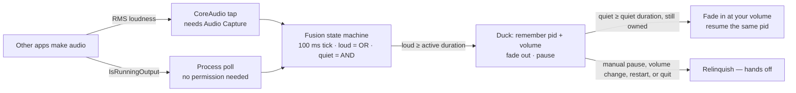

<div align="center">
  
  <h1>Sonar</h1>
  <p><strong>Spotify in your macOS menu bar, with hybrid auto-pause.</strong></p>
  <p>
    <a href="#install">Install</a> ·
    <a href="#features">Features</a> ·
    <a href="#how-it-works">How it works</a> ·
    <a href="#troubleshooting">Troubleshooting</a> ·
    <a href="#development">Development</a> ·
    <a href="#contributing">Contributing</a> ·
    <a href="#credits--provenance">Credits</a>
  </p>
</div>

<p align="center">
  <a href="https://github.com/Kathir-D/Sonar/actions/workflows/ci.yml"></a>
  <a href="https://github.com/Kathir-D/Sonar/releases"></a>
  
  
  
  
  <a href="LICENSE"></a>
  <a href="https://github.com/Kathir-D/Sonar/stargazers"></a>
</p>

Sonar puts the current Spotify track in your macOS menu bar with click-to-open playback controls,
and steps out of the way when something else starts making noise: it fades the music down, pauses
it, and fades it back in once the room goes quiet again.

Detection is **hybrid** — a CoreAudio tap measures real loudness, a process poll catches anything
the tap misses, and a fusion state machine decides when to duck. Sonar only ever resumes Spotify
if *it* was the one that paused it.

---

## Contents

- [Demo](#demo)
- [Features](#features)
- [Why two detectors?](#why-two-detectors)
- [Requirements](#requirements)
- [Install](#install)
  - [Homebrew (planned)](#homebrew-planned)
  - [Build from source](#build-from-source)
- [Set up Spotify liking](#set-up-spotify-liking)
- [Usage](#usage)
- [How it works](#how-it-works)
- [Permissions](#permissions)
- [Troubleshooting](#troubleshooting)
- [Development](#development)
- [Contributing](#contributing)
- [Credits &amp; provenance](#credits--provenance)
- [License](#license)

---

## Demo

A GIF of the full cycle is still to be recorded (tracked in `TODO.md` task 9). It will show three
beats:

1. **Now playing** — artist and title in the menu bar; click the item for the playback panel.
2. **Ducking** — something else starts making noise; Spotify fades out over 2 s and pauses.
3. **Resume** — 3 s of silence later, Spotify fades back in to the volume you had set.

Until then, the architecture diagram below and the Auto-Pause diagnostics pane in Preferences are
the best description of the behavior.

---

## Features

**Now playing**

- Artist and title in the menu bar, with app icon, playing and liked indicators.
- Click the menu-bar item for a playback panel: artwork, play/pause, next, previous, like, and a
  scrubbable playback position with elapsed and total time.
- Global keyboard shortcuts for play/pause, next, previous, like, and unlike.
- Compact two-row layout or a single-row layout, with a configurable maximum width.
- Live preview of the menu bar and playback window in Preferences, plus theming
  (foreground, hover tint, blur).

**Auto-pause**

- **Hybrid detection** — CoreAudio process taps for real RMS loudness, fused with
  `IsRunningOutput` process polling so a denied permission degrades instead of breaking.
- **Three duck modes** — *Fade + Pause* (fade out, pause, fade back in), *Instant*, or
  *Mute only* (never pauses).
- **Configurable timing** — active and quiet streak durations, fade lengths, and the RMS
  loudness threshold.
- **Per-app rules** — *All except…* or *Only…* lists of bundle IDs, with a live "heard in the
  last 3 minutes" finder so you can see what is actually making noise.
- **Correct ownership** — Sonar resumes only if it paused the same Spotify process. Any manual
  pause, volume change, player restart, or quit releases ownership and restores your volume.
- **No Premium required** — playback control goes through AppleScript, so it works with a normal
  Spotify install and with `headless-spotify` (same `com.spotify.client` bundle).

**Diagnostics**

- Preferences › Auto-Pause shows engine state, tap/poll status, live RMS, duck and resume
  countdowns, and the last decision.
- Bounded rotating log, capped at 256 KB; the exact path is shown in the diagnostics pane.
- In-app Sparkle updates with EdDSA-verified releases.

[⬆ Back to top](#sonar)

---

## Why two detectors?

Each signal alone has a failure mode. Running both and fusing them removes most of them:

| Signal | Needs permission | Gives you | Blind spot |
| --- | --- | --- | --- |
| **Process poll** (`IsRunningOutput`) | No | Which app is playing, cheaply, ~0 idle CPU | A process with an open output stream that is effectively silent still counts as loud |
| **CoreAudio tap** (RMS) | Yes (Audio Capture) | Actual loudness, which is what makes fades feel right | Only sees processes it can tap; a denied permission turns it off entirely |

The tap is what lets Sonar fade smoothly instead of clipping, and it is the reason a quiet app
in the background does not trigger a duck. The poll is the safety net: it keeps auto-pause
working before you grant the permission, after you deny it, and for anything the tap cannot
attach to.

Fusion is deliberately asymmetric — see [How it works](#how-it-works).

[⬆ Back to top](#sonar)

---

## Requirements

| | |
| --- | --- |
| macOS | 15 Sequoia or later |
| Spotify | Desktop app for macOS, any account tier (Premium not required) |
| Toolchain (building) | Xcode 16+, macOS 15 SDK, Swift 6 |
| Permissions | Automation (Apple Events) for Spotify; Audio Capture (optional) |

[⬆ Back to top](#sonar)

---

## Install

> **Status: no release published yet.** `VERSION` is `0.1.0` and the release pipeline is in place,
> but nothing has been tagged — so there is no downloadable binary and no Homebrew tap. Build
> from source for now.

### Homebrew (planned)

```sh
brew install --cask sonar
```

The cask lives at [`Casks/sonar.rb`](Casks/sonar.rb) and is filled in by
`scripts/bump-cask.sh` once a signed release exists. Until then the file carries a placeholder
checksum and will not install.

### Build from source

```sh
git clone https://github.com/Kathir-D/Sonar.git
cd Sonar
scripts/build-app.sh
open dist/Sonar.app
```

`scripts/build-app.sh` builds the Release configuration, stamps `VERSION` into the app bundle, and
copies the result to `dist/Sonar.app`. Local builds are ad-hoc signed, so the first launch needs
**System Settings › Privacy & Security › Open Anyway**.

To run from Xcode instead:

```sh
open SpotMenu.xcodeproj   # the Xcode project is still named after the upstream fork
```

Then build and run the `Sonar` scheme. `Sonar` is a `LSUIElement` (menu-bar only) app — there is
no Dock icon and no main window; look for the Spotify track in the menu bar.

[⬆ Back to top](#sonar)

---

## Set up Spotify liking

Everything except liking works with no setup at all. To like and unlike tracks from the menu-bar
panel, register a free Spotify app:

1. Go to the [Spotify developer dashboard](https://developer.spotify.com/dashboard) and create an
   app (name it anything, e.g. `Sonar`).
2. Add this exact Redirect URI:
   `com.kathird.sonar://callback`
   All lowercase — OAuth redirect URIs are compared case-sensitively.
3. Copy the **Client ID** (not the secret) into Preferences › Music Player › Spotify Client ID,
   press **Test Connection**, then **Log In to Spotify**.

A client secret is never needed or stored: Sonar uses the PKCE authorization-code flow.

[⬆ Back to top](#sonar)

---

## Usage

Click the menu-bar item to toggle the playback panel — artwork, transport controls, the like
button, and a scrubber with elapsed and total time. Hovering inside the panel applies the blur and
tint effect. The right-click menu has Refresh (`R`), Preferences (`⌘,`), and Quit (`Q`).

| Preferences pane | What it controls |
| --- | --- |
| **Auto-Pause** | Enable, duck mode, active/quiet durations, fade lengths, RMS threshold, watch list vs. except list, recent-sources finder, live state, countdowns, log path |
| **Menu Bar** | Which text and icons to show, hide-when-paused, compact view, max width, font weights |
| **Playback** | Hover tint, foreground color, blur and tint intensity, live preview |
| **Shortcuts** | Global hotkeys for play/pause, next, previous, like, unlike |
| **Music Player** | Spotify client ID, liking toggle, connection test |
| **About** | Version, update checks, credits |

Auto-pause defaults:

| Setting | Default | Meaning |
| --- | --- | --- |
| Active duration | 1 s | Another app must stay loud this long before Sonar ducks |
| Quiet duration | 3 s | Everything must stay quiet this long before Sonar resumes |
| Fade out / in | 2 s / 2 s | Volume ramp lengths in *Fade + Pause* mode |
| Loudness threshold | 0.02 RMS | Tap loudness floor for counting as audio |

Settings persist in `UserDefaults` under `autopause.*`. Changing a watch-list rule restarts the
tap; changing timing does not.

[⬆ Back to top](#sonar)

---

## How it works



Each tick refreshes the poll, reads the latest tap sample, and runs one fusion step.

**Fusion rules** (`Packages/AutoPauseEngine/Sources/AutoPauseEngine/FusionState.swift`)

- **Loud is OR.** If *either* detector has been loud for at least the active duration, that is a
  duck candidate. Missing one signal never blocks a duck.
- **Quiet is AND.** Resume only requires *both* detectors quiet for at least the quiet duration.
  Silence in one signal is not enough.
- A single loud blip resets the quiet streak entirely; the streak restarts at the first quiet
  sample after the blip. Gaps shorter than 750 ms inside a loud streak do not reset it.

**Ownership rules** (`Packages/AutoPauseEngine/Sources/AutoPauseEngine/SpotifyFadeAdapter.swift`)

Sonar records the Spotify pid and your volume at duck time, and only resumes that exact process:

| Event | Result |
| --- | --- |
| Another app goes quiet, same pid, still paused by us | Fade in and resume |
| You press pause yourself | Relinquish — Sonar stays out of the way |
| You change the volume yourself | Relinquish, and your volume is preserved |
| Spotify restarts, or a different pid appears | Relinquish, never touch the new process |
| Spotify quits | Relinquish, never launch it |
| A stale fade step is still queued | Cancelled via a generation token |

Volume fades step every 100 ms on a serialized queue, so a fade can be interrupted and cancelled
mid-ramp without leaving Spotify at a random volume.

**Layout**

| Path | Contents |
| --- | --- |
| `Sonar/StatusItem/` | Menu-bar item and its popover |
| `Sonar/Playback/` | Playback panel, scrubber, Spotify auth |
| `Sonar/Preferences/` | SwiftUI preference panes |
| `Sonar/UI/` | Menu, popover window, status-item configuration |
| `Sonar/Engine/` | Engine host, preferences bridge, bounded log |
| `Packages/AutoPauseEngine/` | Standalone Swift package: detectors, fusion, fade adapter, 39 tests |
| `scripts/` | Build, package, sign, appcast, and cask helpers |

[⬆ Back to top](#sonar)

---

## Permissions

| Permission | Why Sonar asks | If you deny it |
| --- | --- | --- |
| **Automation** (Apple Events) for `com.spotify.client` | Read player state, pause/resume, set volume | Auto-pause stays off; the menu-bar display and manual controls still work. Grant under System Settings › Privacy & Security › Automation |
| **Audio Capture** (`NSAudioCaptureUsageDescription`) | Measure other apps' loudness for fades and accurate detection | Falls back to poll-only detection: no RMS reading and no smooth fades, but auto-pause still triggers |

Sonar is sandboxed (see `Sonar/Sonar.entitlements`) and does not ask for Accessibility, Screen
Recording, or Full Disk Access. Its only entitlements beyond the sandbox are Apple Events to
`com.spotify.client` and network access for Spotify login and Sparkle updates — which is why the
log lives inside the app's container.

[⬆ Back to top](#sonar)

---

## Troubleshooting

<details>
<summary><strong>The app will not open — "Sonar" cannot be opened</strong></summary>

Locally built apps are ad-hoc signed. Open **System Settings › Privacy & Security** and click
**Open Anyway**, or right-click the app in Finder › Open. Signed release zips from GitHub Releases
are notarized and do not need this.
</details>

<details>
<summary><strong>Auto-pause is not triggering for an app I expect</strong></summary>

Open Preferences › Auto-Pause and check the watch mode:

- **All except…** ducks for anything not on the except list.
- **Only…** ducks exclusively for the listed bundle IDs.

If the app is in the *Only…* list and still does not trigger, use the **Heard in the last 3
minutes** finder — helper processes are mapped to their responsible parent, but a background
utility that produces audio on another app's behalf may not map to a bundle ID you recognize.
</details>

<details>
<summary><strong>Spotify resumed even though I paused it</strong></summary>

It should not. If it did, ownership was released before the resume, or the quiet streak expired
in the window between your pause and Sonar's next tick. The Auto-Pause diagnostics panel shows the
last decision and the reason, and `~/Library/Logs/Sonar/sonar.log` has the full timeline. Please
open an issue with that output.
</details>

<details>
<summary><strong>It ducks too eagerly, or resumes too late</strong></summary>

Tune it in Preferences › Auto-Pause:

- Raise **Active duration** so brief sounds do not count.
- Lower **Quiet duration** to resume sooner.
- Raise **Loudness threshold** if quiet apps are triggering it (only meaningful with the tap
  active).
- Switch to **Mute only** if you never want playback interrupted.

</details>

<details>
<summary><strong>Sonar runs but the menu bar is empty</strong></summary>

Spotify is not playing, or both the artist and title toggles are off in Preferences › Menu Bar.
Enable **Display Artist** / **Display Title**, and make sure a track is actually playing.
</details>

<details>
<summary><strong>Where are the logs?</strong></summary>

`SonarLog` resolves the library directory through `FileManager`, so it works both sandboxed and
not:

- Sandboxed build:
  `~/Library/Containers/com.KathirD.sonar/Data/Library/Logs/Sonar/sonar.log`
- Unsandboxed build: `~/Library/Logs/Sonar/sonar.log`

The file is capped at 256 KB; the oldest half is dropped on overflow. The exact path is also
shown in Preferences › Auto-Pause › Diagnostics.
</details>

[⬆ Back to top](#sonar)

---

## Development

Requires Xcode 16+, the macOS 15 SDK, and Swift 6.

```sh
# engine test suite (39 tests, runs in seconds — no simulator needed)
swift test --package-path Packages/AutoPauseEngine

# app build
xcodebuild -project SpotMenu.xcodeproj -scheme Sonar -configuration Debug build

# or the scripted Release build that stamps VERSION
scripts/build-app.sh
```

| Script | Purpose |
| --- | --- |
| `scripts/build-app.sh` | Release build → `dist/Sonar.app`, with `VERSION` and a git build number |
| `scripts/package-release.sh` | Zip `dist/Sonar.app` → `dist/<ver>/Sonar-<ver>.zip` + `SHA256SUMS.txt` |
| `scripts/sign-release.sh` | Ad-hoc verification locally; `--release` signs, notarizes, staples, and `spctl`-verifies |
| `scripts/generate-appcast.sh` | Write (and EdDSA-sign) the Sparkle `appcast.xml` for a version |
| `scripts/bump-cask.sh` | Regenerate `Casks/sonar.rb` from a version and SHA-256 |

CI ([`ci.yml`](.github/workflows/ci.yml)) runs the engine tests and a Debug app build on every
push and pull request. Releases ([`release.yml`](.github/workflows/release.yml)) run on `v*` tags:
test, build, package, optionally notarize, and publish the zip plus checksums.

<details>
<summary><strong>Maintainers: cutting a release</strong></summary>

1. Bump `VERSION`, commit, tag `vX.Y.Z`, push the tag. CI tests, builds, packages, and publishes
   `Sonar-<ver>.zip` and `SHA256SUMS.txt`.
2. `scripts/sign-release.sh --release` with `DEVELOPER_ID` and `NOTARY_PROFILE` set, then
   re-attach the stapled zip to the GitHub Release. Without those secrets CI ships an ad-hoc
   artifact and skips notarization.
3. `scripts/generate-appcast.sh <ver> <zip-url>` (Sparkle CLI on `PATH` signs it) and publish
   `appcast.xml` where `SUFeedURL` points — `releases/latest/download/appcast.xml`.
4. `scripts/bump-cask.sh <ver> <sha256>`, copy `Casks/sonar.rb` into the `homebrew-tap` repo, then
   `brew audit --cask --strict sonar` must pass, and verify
   `brew install` / `brew test` / `brew uninstall --zap` on a fresh user.
5. Keep the Sparkle private key in the login Keychain. `SUPublicEDKey` is committed; the private
   half never is.

Bundle ID is `com.KathirD.sonar`. The OAuth redirect URI is lowercase
`com.kathird.sonar://callback`.

</details>

[⬆ Back to top](#sonar)

---

## Contributing

Issues and pull requests are welcome — see [ISSUE_TEMPLATE.md](ISSUE_TEMPLATE.md) for the bug
report format. Before opening a PR:

- **Tests pass:** `swift test --package-path Packages/AutoPauseEngine` (39 tests) and a Debug
  `xcodebuild` of the `Sonar` scheme.
- **Conventional commits:** `feat:`, `fix:`, `chore:`, `docs:`. Small commits.
- **Never commit secrets:** Spotify client ID, signing certificates, `.env`, `dist/`,
  `DerivedData/`, `.build/`.
- **UI is a frozen baseline.** The menu-bar item, playback panel, and existing preference panes
  are kept identical to upstream SpotMenu; new behavior belongs in the Auto-Pause pane or in
  `Packages/AutoPauseEngine`.
- **Record provenance.** Code copied from another project keeps its license header and gets an
  entry in [THIRD-PARTY-NOTICES.md](THIRD-PARTY-NOTICES.md) with the upstream SHA. Do not vendor
  files from unlicensed projects — reimplement from documentation instead.
- **Spotify contract.** Match only `bundleID == com.spotify.client` plus
  `tell application "Spotify" to get player state`; never the Dock or a window. Use explicit
  `play`/`pause`, never the `playpause` toggle. All AppleScript runs off the main thread on a
  serial queue with a timeout.

Design intent and the full task history are in [TODO.md](TODO.md).

[⬆ Back to top](#sonar)

---

## Credits & provenance

Sonar is a fork of [SpotMenu](https://github.com/kmikiy/SpotMenu) by [@kmikiy](https://github.com/kmikiy)
(MIT, 2016) — the menu-bar UI, preference panes, and Spotify controller are its work, kept
pixel-identical. The auto-pause engine is new code on top of that base.

| What | Source | Author | License | Upstream SHA | How used |
| --- | --- | --- | --- | --- | --- |
| Menu UI, preferences, Spotify controller | [kmikiy/SpotMenu](https://github.com/kmikiy/SpotMenu) | @kmikiy | MIT 2016 | `a114819` | Fork base, stripped to Spotify-only |
| Poll detector, ownership patterns | [yasinozmeen/smartpause](https://github.com/yasinozmeen/smartpause) | @yasinozmeen | MIT 2026 | `69f3a9d` | Verbatim port, headers kept |
| Tap and ducking concepts | [mattwong05/FlowSound](https://github.com/mattwong05/FlowSound) | @mattwong05 | No license — ideas only | n/a | Reimplemented from Apple docs, nothing copied |
| CoreAudio tap APIs | Apple Developer documentation | Apple | — | — | Clean-room implementation |

Full license texts and per-file notes: [THIRD-PARTY-NOTICES.md](THIRD-PARTY-NOTICES.md).

---

## License

MIT — see [LICENSE](LICENSE). Upstream notices are preserved in
[THIRD-PARTY-NOTICES.md](THIRD-PARTY-NOTICES.md).

[⬆ Back to top](#sonar)
