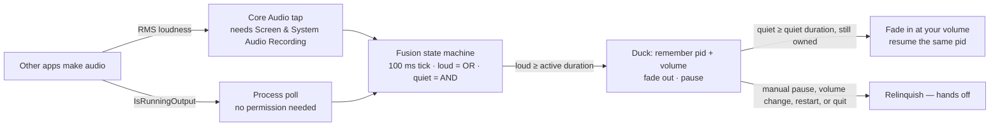

<div align="center">
  
  <h1>Sonar</h1>
  <p><strong>Spotify in your macOS menu bar, with hybrid auto-pause.</strong></p>
  <p>
    <a href="#install">Install</a> ·
    <a href="#features">Features</a> ·
    <a href="#how-it-works">How it works</a> ·
    <a href="#troubleshooting">Troubleshooting</a> ·
    <a href="#development">Development</a> ·
    <a href="#contributing">Contributing</a> ·
    <a href="#credits--provenance">Credits</a>
  </p>
</div>

<p align="center">
  <a href="https://github.com/Kathir-D/Sonar/actions/workflows/ci.yml"></a>
  <a href="https://github.com/Kathir-D/Sonar/releases"></a>
  
  
  
  
  <a href="LICENSE"></a>
  <a href="https://github.com/Kathir-D/Sonar/stargazers"></a>
</p>

Sonar puts the current Spotify track in your macOS menu bar with click-to-open playback controls,
and steps out of the way when something else starts making noise: it fades the music down, pauses
it, and fades it back in once the room goes quiet again.

Detection is **hybrid** — a CoreAudio tap measures real loudness, a process poll catches anything
the tap misses, and a fusion state machine decides when to duck. Sonar only ever resumes Spotify
if *it* was the one that paused it.

---

## Contents

- [Demo](#demo)
- [Features](#features)
- [Why two detectors?](#why-two-detectors)
- [Requirements](#requirements)
- [Install](#install)
  - [Homebrew (planned)](#homebrew-planned)
  - [Build from source](#build-from-source)
- [Set up Spotify liking](#set-up-spotify-liking)
- [Usage](#usage)
  - [Presets](#presets)
  - [Advanced settings](#advanced-settings)
- [How it works](#how-it-works)
- [Permissions](#permissions)
- [Troubleshooting](#troubleshooting)
- [Development](#development)
- [Contributing](#contributing)
- [Credits &amp; provenance](#credits--provenance)
- [License](#license)

---

## Demo

A GIF of the full cycle is still to be recorded (tracked in `TODO.md` task 9). It will show three
beats:

1. **Now playing** — artist and title in the menu bar; click the item for the playback panel.
2. **Ducking** — something else starts making noise; Spotify fades out over 2 s and pauses.
3. **Resume** — 3 s of silence later, Spotify fades back in to the volume you had set.

Until then, the architecture diagram below and the Auto-Pause diagnostics pane in Preferences are
the best description of the behavior.

---

## Features

**Now playing**

- Artist and title in the menu bar, with app icon, playing and liked indicators.
- Click the menu-bar item for a playback panel: artwork, play/pause, next, previous, like, and a
  scrubbable playback position with elapsed and total time.
- Global keyboard shortcuts for play/pause, next, previous, like, and unlike.
- Compact two-row layout or a single-row layout, with a configurable maximum width.
- Live preview of the menu bar and playback window in Preferences, plus theming
  (foreground, hover tint, blur).

**Auto-pause**

- **Hybrid detection** — a Core Audio tap measures real RMS loudness, fused with
  `IsRunningOutput` process polling for anything the tap cannot attach to.
- **Two presets, or your own** — *Fade* eases the music down and back up, *Instant* cuts it out
  and back in the moment; anything you tune yourself shows as *Custom*.
- **Configurable timing** — trigger delay, resume delay, fade length, and the loudness
  threshold, all behind *Advanced settings*.
- **Per-app rules** — *All apps* or *Only these apps*, with a live "heard in the last 3 minutes"
  finder so you can see what is actually making noise.
- **Correct ownership** — Sonar resumes only if it paused the same Spotify process. Any manual
  pause, volume change, player restart, or quit releases ownership and restores your volume.
- **No Premium required** — playback control goes through AppleScript, so it works with a normal
  Spotify install and with `headless-spotify` (same `com.spotify.client` bundle).

**Diagnostics**

- Preferences › Auto-Pause shows engine state, which detector is driving, tap RMS, duck and
  resume countdowns, the last decision, and the exact log path.
- Bounded rotating log, capped at 256 KB.
- In-app Sparkle updates with EdDSA-verified releases.

[⬆ Back to top](#sonar)

---

## Why two detectors?

Each signal alone has a failure mode. Running both and fusing them removes most of them:

| Signal | Needs permission | Gives you | Blind spot |
| --- | --- | --- | --- |
| **Process poll** (`IsRunningOutput`) | No | Which app is playing, cheaply, ~0 idle CPU | A process with an open output stream that is effectively silent still counts as loud |
| **Core Audio tap** (RMS) | Yes (Screen & System Audio Recording) | Actual loudness, which is what makes fades feel right | Only sees processes it can tap, so a granted permission that is not delivering audio leaves it silent too |

The tap is what lets Sonar fade smoothly instead of clipping, and it is the reason a quiet app
in the background does not trigger a duck. The poll is the safety net for anything the tap
cannot attach to — but it is not a substitute for the permission: Auto-Pause will not switch on
without both grants, because without loudness there is no way to tell a paused video from a
silent one.

Fusion is deliberately asymmetric — see [How it works](#how-it-works).

[⬆ Back to top](#sonar)

---

## Requirements

| | |
| --- | --- |
| macOS | 15 Sequoia or later |
| Spotify | Desktop app for macOS, any account tier (Premium not required) |
| Toolchain (building) | Xcode 16+, macOS 15 SDK, Swift 6 |
| Permissions (Auto-Pause) | Screen & System Audio Recording **and** Automation for Spotify — both, or the feature stays off |

[⬆ Back to top](#sonar)

---

## Install

> **Status: no release published yet.** `VERSION` is `0.1.0` and the release pipeline is in place,
> but nothing has been tagged — so there is no downloadable binary and no Homebrew tap. Build
> from source for now.

### Homebrew (planned)

```sh
brew install --cask sonar
```

The cask lives at [`Casks/sonar.rb`](Casks/sonar.rb) and is filled in by
`scripts/bump-cask.sh` once a signed release exists. Until then the file carries a placeholder
checksum and will not install.

### Build from source

```sh
git clone https://github.com/Kathir-D/Sonar.git
cd Sonar
scripts/build-app.sh
open dist/Sonar.app
```

`scripts/build-app.sh` builds the Release configuration, stamps `VERSION` into the app bundle, and
copies the result to `dist/Sonar.app`. Local builds are ad-hoc signed, so the first launch needs
**System Settings › Privacy & Security › Open Anyway**.

To run from Xcode instead:

```sh
open SpotMenu.xcodeproj   # the Xcode project is still named after the upstream fork
```

Then build and run the `Sonar` scheme. `Sonar` is a `LSUIElement` (menu-bar only) app — there is
no Dock icon and no main window; look for the Spotify track in the menu bar.

[⬆ Back to top](#sonar)

---

## Set up Spotify liking

Everything except liking works with no setup at all. To like and unlike tracks from the menu-bar
panel, register a free Spotify app:

1. Go to the [Spotify developer dashboard](https://developer.spotify.com/dashboard) and create an
   app (name it anything, e.g. `Sonar`).
2. Add this exact Redirect URI:
   `com.kathird.sonar://callback`
   All lowercase — OAuth redirect URIs are compared case-sensitively.
3. Copy the **Client ID** (not the secret) into Preferences › Music Player › Spotify Client ID,
   press **Test Connection**, then **Log In to Spotify**.

A client secret is never needed or stored: Sonar uses the PKCE authorization-code flow.

[⬆ Back to top](#sonar)

---

## Usage

Click the menu-bar item to toggle the playback panel — artwork, transport controls, the like
button, and a scrubber with elapsed and total time. Hovering inside the panel applies the blur and
tint effect. The right-click menu has Refresh (`R`), Preferences (`⌘,`), and Quit (`Q`).

| Preferences pane | What it controls |
| --- | --- |
| **Auto-Pause** | Enable, permissions, the two presets, fade length, *Advanced settings*, watch list vs. only-list, recent-sources finder, live state, countdowns, log path |
| **Menu Bar** | Which text and icons to show, hide-when-paused, compact view, max width, font weights |
| **Playback** | Hover tint, foreground color, blur and tint intensity, live preview |
| **Shortcuts** | Global hotkeys for play/pause, next, previous, like, unlike |
| **Music Player** | Spotify client ID, liking toggle, connection test |
| **About** | Version, update checks, credits |

### Presets

Auto-Pause starts from a preset, and each preset is a whole configuration — the duck behaviour
*and* the timings that go with it — so *Instant* really is instant instead of inheriting
*Fade*'s multi-second waits.

| | Fade | Instant |
| --- | --- | --- |
| What it does | Music eases down while the other app plays, pauses, waits for the room to go quiet, then eases back up | Music stops as soon as another app is heard and starts again the moment it goes quiet |
| How it sounds | Nothing is clipped, but the first and last moments of speech can slip underneath it | Nothing is clipped, but the change is abrupt |
| Trigger delay | 1 s of sound before Sonar pauses | 0.1 s |
| Resume delay | 3 s of quiet before Sonar resumes | 0.3 s |
| Fade length | 2 s, one length for both directions | None — there is no fade to set |

*Custom* is not a third choice you can pick: it appears when your values stop matching either
preset, and the pane says so. Clicking *Fade* or *Instant* again, or *Reset to …* in
*Advanced settings*, puts you back on a preset.

### Advanced settings

Every preset has the same collapsible *Advanced settings* section. It is where the timings
actually live, and moving any slider out of a preset's values is what switches the pane to
*Custom*.

| Control | Range | What it does |
| --- | --- | --- |
| Fade length | 0–5 s, in 0.5 s steps | One length for both directions; the only Fade control. *Instant* has no fade, so the pane offers a *Use a fade instead* button instead |
| Trigger delay | 0–5 s | How long another app has to keep making sound before Sonar pauses |
| Resume delay | 0–10 s | How long everything has to stay quiet before Sonar starts again |
| Loudness sensitivity | *Only loud sound* → *Even a whisper* | The RMS floor for counting as audio. Dragging right picks up more; the slider is inverted because the engine compares `rms >= threshold` |
| Which apps count | *All apps* / *Only these apps* | A read-only summary of the list below — the control itself is in *Which apps pause your music*, and the sentence under it spells out the result |

When the values are yours rather than a preset's, *Advanced settings* also offers **Reset to
Fade** or **Reset to Instant**.

The *Heard in the last 3 minutes* list underneath is the quickest way to find the bundle ID of
whatever is making noise. Tabs are not listed separately — a browser counts as one app.

Settings persist in `UserDefaults` under `autopause.*`. Changing a watch-list rule restarts the
tap; changing timing does not.

[⬆ Back to top](#sonar)

---

## How it works



Each tick refreshes the poll, reads the latest tap sample, and runs one fusion step.

**Fusion rules** (`Packages/AutoPauseEngine/Sources/AutoPauseEngine/FusionState.swift`)

- **Loud is OR.** If *either* detector has been loud for at least the active duration, that is a
  duck candidate. Missing one signal never blocks a duck.
- **Quiet is AND.** Resume only requires *both* detectors quiet for at least the quiet duration.
  Silence in one signal is not enough.
- A single loud blip resets the quiet streak entirely; the streak restarts at the first quiet
  sample after the blip. Gaps shorter than 750 ms inside a loud streak do not reset it.

**Ownership rules** (`Packages/AutoPauseEngine/Sources/AutoPauseEngine/SpotifyFadeAdapter.swift`)

Sonar records the Spotify pid and your volume at duck time, and only resumes that exact process:

| Event | Result |
| --- | --- |
| Another app goes quiet, same pid, still paused by us | Fade in and resume |
| You press pause yourself | Relinquish — Sonar stays out of the way |
| You change the volume yourself | Relinquish, and your volume is preserved |
| Spotify restarts, or a different pid appears | Relinquish, never touch the new process |
| Spotify quits | Relinquish, never launch it |
| A stale fade step is still queued | Cancelled via a generation token |

Volume fades step every 100 ms on a serialized queue, so a fade can be interrupted and cancelled
mid-ramp without leaving Spotify at a random volume.

**Layout**

| Path | Contents |
| --- | --- |
| `Sonar/StatusItem/` | Menu-bar item and its popover |
| `Sonar/Playback/` | Playback panel, scrubber, Spotify auth |
| `Sonar/Preferences/` | SwiftUI preference panes |
| `Sonar/UI/` | Menu, popover window, status-item configuration |
| `Sonar/Engine/` | Engine host, preferences bridge, bounded log |
| `Packages/AutoPauseEngine/` | Standalone Swift package: detectors, fusion, fade adapter, and its test suite |
| `scripts/` | Build, package, sign, appcast, and cask helpers |

[⬆ Back to top](#sonar)

---

## Permissions

Auto-Pause needs exactly two permissions, and it will not switch on without both. Preferences ›
Auto-Pause shows both at the top of the pane with their live state, and the button next to each
one does whatever actually helps: *Grant…* while macOS will still prompt, *Open System
Settings* after it has stopped asking.

| Permission | Why Sonar asks | Where to grant it | If it is missing |
| --- | --- | --- | --- |
| **Screen & System Audio Recording** | It owns the Core Audio tap, so this is what lets it measure how loud other apps are — the only way to tell speech from silence | System Settings › Privacy & Security › **Screen & System Audio Recording** | Auto-Pause cannot be switched on at all. The toggle is disabled and the pane names the missing permission |
| **Automation** (Apple Events) for `com.spotify.client` | Every Spotify action is an Apple Event: read the player state, pause, resume, set the volume | System Settings › Privacy & Security › **Automation**, listed under Sonar | Auto-Pause cannot be switched on at all — and because the menu bar reads the current track the same way, the track disappears from the menu bar and the playback controls stop doing anything |

Two things degrade without turning anything off. If the screen-recording grant is in place but
no audio is reaching Sonar — the permission exists, the capability does not — the state dot
turns orange and reads *Watching by process only*, and detection falls back to polling, which
cannot tell silence from sound. And if Spotify is not running, the Automation row says exactly
that instead of reporting a permission problem, because there is nothing to ask it.

Once you have refused a permission, macOS will not prompt for it again: the button becomes *Open
System Settings*, and the grant is bound to the app's code signature, so a rebuild can send you
back to System Settings.

Sonar is sandboxed (see `Sonar/Sonar.entitlements`) and asks for nothing else — no Accessibility,
no Full Disk Access, no microphone. Its only entitlements beyond the sandbox are Apple Events to
`com.spotify.client` and network access for Spotify login and Sparkle updates, which is why the
log lives inside the app's container.

[⬆ Back to top](#sonar)

---

## Troubleshooting

<details>
<summary><strong>The app will not open — "Sonar" cannot be opened</strong></summary>

Locally built apps are ad-hoc signed. Open **System Settings › Privacy & Security** and click
**Open Anyway**, or right-click the app in Finder › Open. Signed release zips from GitHub Releases
are notarized and do not need this.
</details>

<details>
<summary><strong>Auto-Pause will not switch on</strong></summary>

Both permissions have to be in place first, so the toggle is disabled until they are, and the
pane tells you which one is standing in the way: *Sonar needs Screen & System Audio Recording
before Auto-Pause can switch on*.

1. Open Preferences › Auto-Pause › **Permissions** and read the two rows. Each says *Not
   granted* (macOS will still prompt) or *Turned off* (it will not prompt again).
2. Press **Grant…** on the row that needs it and answer the system dialog. The system-audio
   prompt only appears while the tap is actually being started, which is why the button restarts
   the detector too.
3. If a row says *Turned off*, macOS has already been told no and will not ask again — press
   **Open System Settings** and flip it on there. The pane re-checks on its own, so come back
   and the row turns green.
4. *Spotify isn't running, so this is unchecked* is not a permission problem. There is nothing
   to ask until Spotify is open; start it and the row settles by itself.

Note that the grant is tied to the app's code signature: a rebuild from source can invalidate it
and send you back to System Settings for the same reason.
</details>

<details>
<summary><strong>The state dot says "Watching by process only"</strong></summary>

That is the honest answer to a question the icon cannot ask: the permission is granted, but no
system audio is reaching Sonar. Preferences › Auto-Pause › **Diagnostics** shows which detector
is really driving the decisions — *System audio (tap)* or *Process polling only* — next to the
live tap RMS.

Polling can only ask which apps hold the audio output, not whether they are making sound, so
everything follows from that: a muted or paused app still counts as loud, and a genuinely silent
one can hold the resume. Press **Try again** on the banner or on the permission row — it restarts
the detector, which is also the way to make the macOS prompt reappear. If the tap still does not
come up, the app says *Granted, but no system audio is reaching Sonar yet*, and the
`tap unavailable:` line in the log carries the reason.
</details>

<details>
<summary><strong>Auto-pause does not trigger for a browser</strong></summary>

Two different things, and the pane tells you which one you are looking at.

- **Nothing happens at all.** Check **Which apps pause your music**: *Only these apps* ignores
  everything that is not on the watched list, and *All apps* ignores whatever is on it. A browser
  is one entry — tabs are not listed separately — so it is all-or-nothing per browser. The
  **Heard in the last 3 minutes** list shows the bundle ID of anything that has made noise
  recently; helper processes are mapped to their responsible parent, but a background utility
  producing audio on another app's behalf may not map to a bundle ID you recognize.
- **It pauses, but a paused tab keeps the music from coming back.** With the detector on process
  polling, Sonar cannot measure silence, so it waits for the app to let go of the audio output.
  Browsers often keep an output stream open for a paused tab, and that can hold the resume for
  many seconds. Watch the state dot: *Watching by process only* is this exact situation, and it
  is fixed by granting Screen & System Audio Recording, not by waiting.
</details>

<details>
<summary><strong>Auto-pause is not triggering for an app I expect</strong></summary>

Open Preferences › Auto-Pause and check the watch mode:

- **All apps** pauses for anything not on the ignored list.
- **Only these apps** pauses exclusively for the listed bundle IDs.

If the app is in the *Only these apps* list and still does not trigger, use the **Heard in the
last 3 minutes** finder — helper processes are mapped to their responsible parent, but a
background utility that produces audio on another app's behalf may not map to a bundle ID you
recognize.
</details>

<details>
<summary><strong>Spotify resumed even though I paused it</strong></summary>

It should not. If it did, ownership was released before the resume, or the quiet streak expired
in the window between your pause and Sonar's next tick. The Auto-Pause diagnostics panel shows the
last decision and the reason, and `sonar.log` has the full timeline. Please open an issue with
that output.
</details>

<details>
<summary><strong>It ducks too eagerly, or resumes too late</strong></summary>

Tune it under Preferences › Auto-Pause › **Advanced settings**:

- Raise **Trigger delay** so brief sounds do not count.
- Lower **Resume delay** to resume sooner.
- Move **Loudness sensitivity** left if quiet apps are triggering it (only meaningful while the
  tap is driving).
- Pick the **Instant** preset if you want no fade at all, or **Fade** if the abruptness is what
  bothers you.
</details>

<details>
<summary><strong>Sonar runs but the menu bar is empty</strong></summary>

Spotify is not playing, or both the artist and title toggles are off in Preferences › Menu Bar.
Enable **Display Artist** / **Display Title**, and make sure a track is actually playing.

If Spotify is definitely playing and the menu bar is still empty, the Automation permission for
`com.spotify.client` is the thing to check: Sonar reads the current track over Apple Events, and a
refused Apple Event is reported as "no information" rather than as an error, so the symptom is
simply an empty menu bar.
</details>

<details>
<summary><strong>Where are the logs?</strong></summary>

`SonarLog` resolves the library directory through `FileManager`, so it works both sandboxed and
not:

- Sandboxed build:
  `~/Library/Containers/com.KathirD.sonar/Data/Library/Logs/Sonar/sonar.log`
- Unsandboxed build: `~/Library/Logs/Sonar/sonar.log`

The file is capped at 256 KB; the oldest half is dropped on overflow. The exact path is also
shown in Preferences › Auto-Pause › **Diagnostics**, on the *Log* row — copy it from there rather
than guessing, because which of the two applies depends on how the app was built.

The lines worth reading are `engine started`, `tap verified:` / `tap unavailable:` (which detector
is driving), `candidate:`, `ducked:`, `restored`, and `relinquished:` (why Sonar handed playback
back instead of resuming it).
</details>

[⬆ Back to top](#sonar)

---

## Development

Requires Xcode 16+, the macOS 15 SDK, and Swift 6.

```sh
# engine test suite (runs in seconds — no simulator needed)
swift test --package-path Packages/AutoPauseEngine

# app build
xcodebuild -project SpotMenu.xcodeproj -scheme Sonar -configuration Debug build

# or the scripted Release build that stamps VERSION
scripts/build-app.sh
```

| Script | Purpose |
| --- | --- |
| `scripts/build-app.sh` | Release build → `dist/Sonar.app`, with `VERSION` and a git build number |
| `scripts/package-release.sh` | Zip `dist/Sonar.app` → `dist/<ver>/Sonar-<ver>.zip` + `SHA256SUMS.txt` |
| `scripts/sign-release.sh` | Ad-hoc verification locally; `--release` signs, notarizes, staples, and `spctl`-verifies |
| `scripts/generate-appcast.sh` | Write (and EdDSA-sign) the Sparkle `appcast.xml` for a version |
| `scripts/bump-cask.sh` | Regenerate `Casks/sonar.rb` from a version and SHA-256 |
| `scripts/autopause-smoke.sh` | End-to-end: force the Instant preset, play a test tone, and measure how long Spotify takes to pause and resume |

The end-to-end check is deliberately not part of CI: it needs a real audio device, a running
Spotify, and the two privacy grants, and audio on a build machine is a shared resource — only
one such test may run at a time.

```sh
# print every command it would run, without touching audio, Spotify, or defaults
scripts/autopause-smoke.sh --dry-run

# against the installed app: quits Sonar, forces the Instant preset, tests, restores
scripts/autopause-smoke.sh
```

CI ([`ci.yml`](.github/workflows/ci.yml)) runs the engine tests and a Debug app build on every
push and pull request. Releases ([`release.yml`](.github/workflows/release.yml)) run on `v*` tags:
test, build, package, optionally notarize, and publish the zip plus checksums.

<details>
<summary><strong>Maintainers: cutting a release</strong></summary>

1. Bump `VERSION`, commit, tag `vX.Y.Z`, push the tag. CI tests, builds, packages, and publishes
   `Sonar-<ver>.zip` and `SHA256SUMS.txt`.
2. `scripts/sign-release.sh --release` with `DEVELOPER_ID` and `NOTARY_PROFILE` set, then
   re-attach the stapled zip to the GitHub Release. Without those secrets CI ships an ad-hoc
   artifact and skips notarization.
3. `scripts/generate-appcast.sh <ver> <zip-url>` (Sparkle CLI on `PATH` signs it) and publish
   `appcast.xml` where `SUFeedURL` points — `releases/latest/download/appcast.xml`.
4. `scripts/bump-cask.sh <ver> <sha256>`, copy `Casks/sonar.rb` into the `homebrew-tap` repo, then
   `brew audit --cask --strict sonar` must pass, and verify
   `brew install` / `brew test` / `brew uninstall --zap` on a fresh user.
5. Keep the Sparkle private key in the login Keychain. `SUPublicEDKey` is committed; the private
   half never is.

Bundle ID is `com.KathirD.sonar`. The OAuth redirect URI is lowercase
`com.kathird.sonar://callback`.

</details>

[⬆ Back to top](#sonar)

---

## Contributing

Issues and pull requests are welcome — see [ISSUE_TEMPLATE.md](ISSUE_TEMPLATE.md) for the bug
report format. Before opening a PR:

- **Tests pass:** `swift test --package-path Packages/AutoPauseEngine` and a Debug
  `xcodebuild` of the `Sonar` scheme.
- **Conventional commits:** `feat:`, `fix:`, `chore:`, `docs:`. Small commits.
- **Never commit secrets:** Spotify client ID, signing certificates, `.env`, `dist/`,
  `DerivedData/`, `.build/`.
- **UI is a frozen baseline.** The menu-bar item, playback panel, and existing preference panes
  are kept identical to upstream SpotMenu; new behavior belongs in the Auto-Pause pane or in
  `Packages/AutoPauseEngine`.
- **Record provenance.** Code copied from another project keeps its license header and gets an
  entry in [THIRD-PARTY-NOTICES.md](THIRD-PARTY-NOTICES.md) with the upstream SHA. Do not vendor
  files from unlicensed projects — reimplement from documentation instead.
- **Spotify contract.** Match only `bundleID == com.spotify.client` plus
  `tell application "Spotify" to get player state`; never the Dock or a window. Use explicit
  `play`/`pause`, never the `playpause` toggle. All AppleScript runs off the main thread on a
  serial queue with a timeout.

Design intent and the full task history are in [TODO.md](TODO.md).

[⬆ Back to top](#sonar)

---

## Credits & provenance

Sonar is a fork of [SpotMenu](https://github.com/kmikiy/SpotMenu) by [@kmikiy](https://github.com/kmikiy)
(MIT, 2016) — the menu-bar UI, preference panes, and Spotify controller are its work, kept
pixel-identical. The auto-pause engine is new code on top of that base.

| What | Source | Author | License | Upstream SHA | How used |
| --- | --- | --- | --- | --- | --- |
| Menu UI, preferences, Spotify controller | [kmikiy/SpotMenu](https://github.com/kmikiy/SpotMenu) | @kmikiy | MIT 2016 | `a114819` | Fork base, stripped to Spotify-only |
| Poll detector, ownership patterns | [yasinozmeen/smartpause](https://github.com/yasinozmeen/smartpause) | @yasinozmeen | MIT 2026 | `69f3a9d` | Verbatim port, headers kept |
| Tap and ducking concepts | [mattwong05/FlowSound](https://github.com/mattwong05/FlowSound) | @mattwong05 | No license — ideas only | n/a | Reimplemented from Apple docs, nothing copied |
| CoreAudio tap APIs | Apple Developer documentation | Apple | — | — | Clean-room implementation |

Full license texts and per-file notes: [THIRD-PARTY-NOTICES.md](THIRD-PARTY-NOTICES.md).

---

## License

MIT — see [LICENSE](LICENSE). Upstream notices are preserved in
[THIRD-PARTY-NOTICES.md](THIRD-PARTY-NOTICES.md).

[⬆ Back to top](#sonar)
