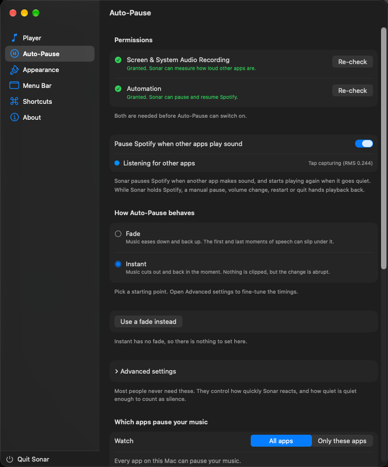
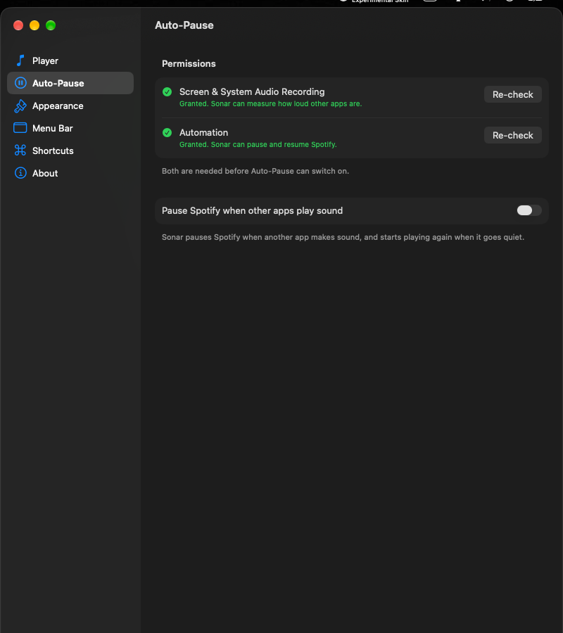
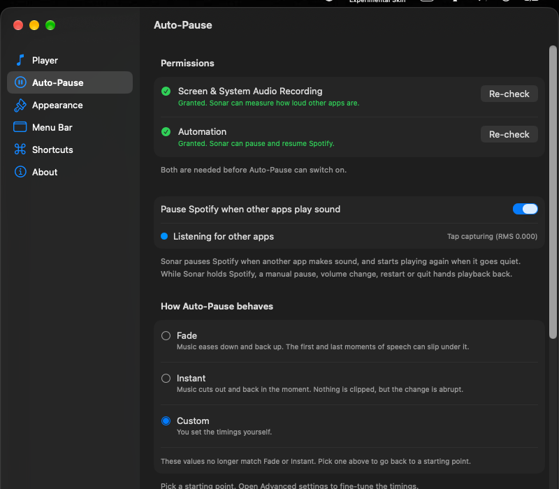
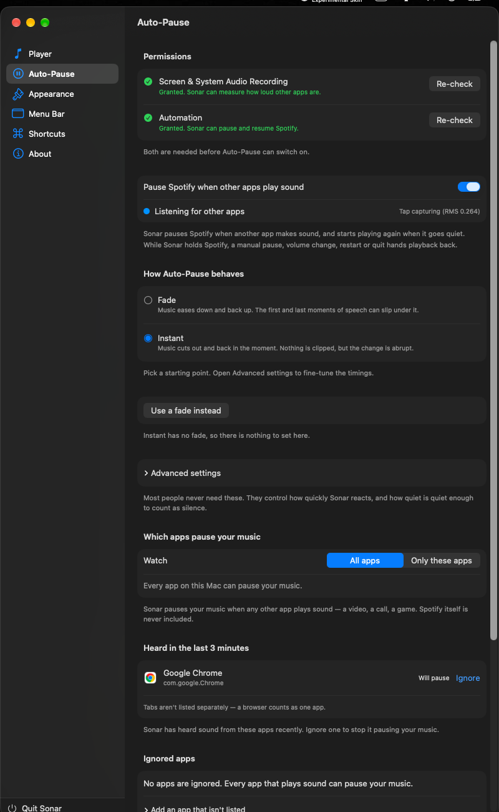
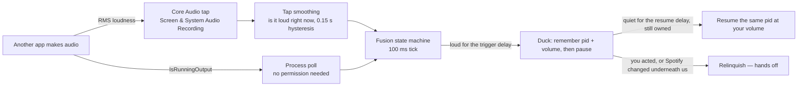

<div align="center">
  
  <h1>Sonar</h1>
  <p><strong>Spotify in your macOS menu bar, with hybrid auto-pause.</strong></p>
  <p>
    <a href="#screenshots">Screenshots</a> ·
    <a href="#features">Features</a> ·
    <a href="#install">Install</a> ·
    <a href="#auto-pause">Auto-Pause</a> ·
    <a href="#troubleshooting">Troubleshooting</a> ·
    <a href="#development">Development</a> ·
    <a href="#contributing">Contributing</a> ·
    <a href="#credits--provenance">Credits</a>
  </p>
</div>

<p align="center">
  <a href="https://github.com/Kathir-D/Sonar/actions/workflows/ci.yml"></a>
  <a href="https://github.com/Kathir-D/Sonar/releases"></a>
  
  
  
  
  <a href="LICENSE"></a>
  <a href="https://github.com/Kathir-D/Sonar/stargazers"></a>
</p>

Sonar puts the current Spotify track in your macOS menu bar, and gets out of the way when something
else starts making noise — it pauses the music, and starts it again once the room goes quiet.

Deciding "is something actually making sound" is the hard part, and a process poll cannot do it: a
paused video in a browser still holds the audio output open, so a poll sees it as loud forever and
your music never comes back. So Sonar measures **real loudness** with a Core Audio tap, and uses
polling only as a fallback. A fusion state machine decides when to duck, and Sonar only ever
resumes Spotify if *it* was the one that paused it.

| | measured, on a MacBook Pro, Instant preset |
| --- | --- |
| Time from another app making sound to Spotify pausing | **0.33 s** |
| Time from the room going quiet to Spotify resuming | **0.32 s** |

Numbers are measured from the moment sound reaches the speakers, not from a keypress, and
`scripts/autopause-smoke.sh` re-checks them on demand.

---

## Contents

- [Screenshots](#screenshots)
- [Features](#features)
- [Requirements](#requirements)
- [Install](#install)
  - [Homebrew](#homebrew)
  - [Build from source](#build-from-source)
- [Set up Spotify liking](#set-up-spotify-liking)
- [Usage](#usage)
  - [Preferences at a glance](#preferences-at-a-glance)
- [Auto-Pause](#auto-pause)
  - [The problem: a poll cannot measure silence](#the-problem-a-poll-cannot-measure-silence)
  - [Presets](#presets)
  - [Advanced settings](#advanced-settings)
  - [Which apps pause your music](#which-apps-pause-your-music)
  - [How the decision is made](#how-the-decision-is-made)
  - [Ownership: never fight the user](#ownership-never-fight-the-user)
  - [Permissions](#permissions)
  - [Measured behaviour](#measured-behaviour)
  - [Known limitations](#known-limitations)
- [Troubleshooting](#troubleshooting)
- [Development](#development)
- [Project layout](#project-layout)
- [Contributing](#contributing)
- [Credits &amp; provenance](#credits-provenance)
- [License](#license)

---

## Screenshots

**Auto-Pause opens on its permissions**, because it cannot work without them, and the pane says so
before it offers anything else. Each row shows a live state and a button that does the thing that
actually helps — *Grant…* while macOS will still prompt, *Open System Settings* after it has stopped
asking. The dot under the toggle is the engine's own state, including the loudness it is measuring
right now.



**When Auto-Pause is off, the rest of the pane is hidden.** No sliders, no lists, nothing to
misread — just the toggle and what is still needed to use it.



**The presets explain themselves**, and *Custom* is not a choice you pick — it appears when a value
stops matching a preset, and the pane says why.



**The whole pane, including which apps count.**



[⬆ Back to top](#sonar)

---

## Features

**Now playing**

- Artist and title in the menu bar, with app icon, playing and liked indicators.
- Click the menu-bar item for a playback panel: artwork, play/pause, next, previous, like, and a
  scrubbable playback position with elapsed and total time.
- Global keyboard shortcuts for play/pause, next, previous, like, and unlike.
- Compact two-row layout or a single-row layout, with a configurable maximum width.
- Live preview of the menu bar and playback window in Preferences, plus theming
  (foreground, hover tint, blur).

**Auto-pause**

- **Hybrid detection** — a Core Audio tap measures real RMS loudness, fused with
  `IsRunningOutput` process polling for anything the tap cannot attach to.
- **Two presets, or your own** — *Fade* eases the music down and back up, *Instant* cuts it out
  and back in the moment; anything you tune yourself shows as *Custom*.
- **Configurable timing** — trigger delay, resume delay, fade length, and the loudness
  threshold, all behind *Advanced settings*.
- **Per-app rules** — *All apps* or *Only these apps*, with a live "heard in the last 3 minutes"
  finder so you can see what is actually making noise.
- **Correct ownership** — Sonar resumes only if it paused the same Spotify process. Any manual
  pause, volume change, player restart, or quit releases ownership and restores your volume.
- **No Premium required** — playback control goes through AppleScript, so it works with a normal
  Spotify install and with `headless-spotify` (same `com.spotify.client` bundle).

**Diagnostics**

- Preferences › Auto-Pause shows engine state, which detector is driving, tap RMS, duck and
  resume countdowns, the last decision, and the exact log path.
- Bounded rotating log, capped at 256 KB.
- In-app Sparkle updates with EdDSA-verified releases.

[⬆ Back to top](#sonar)

---

## Requirements

| | |
| --- | --- |
| macOS | 15 Sequoia or later |
| Spotify | The desktop app for macOS. Any account tier — Premium is not needed |
| Permissions (Auto-Pause only) | Screen & System Audio Recording **and** Automation for Spotify. Both, or the feature stays switched off |
| Toolchain (only to build) | Xcode 16+, macOS 15 SDK, Swift 6 |

[⬆ Back to top](#sonar)

---

## Install

> **Status: not released yet.** `VERSION` is `0.1.0`, nothing has been tagged, and there is no
> signed build to download. Build from source for now — it takes about a minute and works
> perfectly well, with one caveat about permissions below.

### Homebrew

```sh
brew install --cask sonar
```

The cask lives at [`Casks/sonar.rb`](Casks/sonar.rb). Its checksum is filled in by the release run
itself, so this starts working as soon as a signed release is tagged. Until then the file carries a
placeholder and will not install.

### Build from source

```sh
git clone https://github.com/Kathir-D/Sonar.git
cd Sonar
scripts/build-app.sh
open dist/Sonar.app
```

`scripts/build-app.sh` builds Release, stamps `VERSION` into the bundle, and leaves the result at
`dist/Sonar.app`.

To run it in Xcode instead:

```sh
open SpotMenu.xcodeproj   # still named after the upstream fork
```

Build and run the `Sonar` scheme. Sonar is an `LSUIElement` app — menu bar only, no Dock icon and
no main window — so look for the Spotify track in the menu bar.

> **One caveat for builds from source.** A local build is ad-hoc signed, and macOS ties the
> Screen & System Audio Recording grant to a code signature. **Every rebuild therefore invalidates
> the grant and macOS asks again.** That is expected, not a bug, and it is why the release pipeline
> signs properly. The first launch of an ad-hoc build also needs **System Settings › Privacy &
> Security › Open Anyway**.

[⬆ Back to top](#sonar)

---

## Set up Spotify liking

Everything except liking works with no setup at all. To like and unlike from the menu-bar panel,
register a free Spotify app:

1. Go to the [Spotify developer dashboard](https://developer.spotify.com/dashboard) and create an
   app. Name it anything, e.g. `Sonar`.
2. Add this exact Redirect URI: `com.kathird.sonar://callback`
   All lowercase — OAuth redirect URIs are compared case-sensitively.
3. Copy the **Client ID** (not the secret) into Preferences › Music Player › Spotify Client ID,
   press **Test Connection**, then **Log In to Spotify**.

A client secret is never needed or stored: Sonar uses the PKCE authorization-code flow.

[⬆ Back to top](#sonar)

---

## Usage

Click the menu-bar item to toggle the playback panel — artwork, transport controls, the like
button, and a scrubber with elapsed and total time. Hovering inside the panel applies the blur and
tint effect. The right-click menu has Refresh (`R`), Preferences (`⌘,`) and Quit (`Q`).

### Preferences at a glance

| Pane | What it controls |
| --- | --- |
| **Auto-Pause** | Permissions, the enable toggle, the two presets, fade length, *Advanced settings*, which apps count, the live app finder, engine state, countdowns, and the log path |
| **Menu Bar** | Which text and icons to show, hide-when-paused, compact view, max width, font weights |
| **Playback** | Hover tint, foreground colour, blur and tint intensity, live preview |
| **Shortcuts** | Global hotkeys for play/pause, next, previous, like, unlike |
| **Music Player** | Spotify client ID, liking toggle, connection test |
| **About** | Version, update checks, credits |

Settings apply as you change them — there is no Save button. Auto-Pause settings persist in
`UserDefaults` under `autopause.*`; changing which apps count rebuilds the tap, changing a timing
does not.

[⬆ Back to top](#sonar)

---

## Auto-Pause

The whole feature, start to finish. If you want the reasoning behind any of it — including the
four separate bugs that stopped the tap from ever delivering a single audio buffer — read
**[docs/HOW-AUTOPAUSE-WORKS.md](docs/HOW-AUTOPAUSE-WORKS.md)**.

### The problem: a poll cannot measure silence

The obvious way to find out whether another app is playing something is to ask Core Audio which
processes are holding the audio output. It needs no permission, costs nothing when idle, and it is
wrong in the one way that matters:

- A browser paused on a video **keeps the output open**. The poll sees it as loud, forever.
- Measured on the development machine, a browser *actively playing* a video reports
  `IsRunningOutput == 0`, while a Core Audio tap of the same system plainly hears the sound.
- 45 seconds of pure digital silence reads as loud.

So polling cannot tell a paused video from a playing one, and a duck based on it never comes back.

Sonar therefore measures **actual loudness** with a Core Audio process tap: a private aggregate
device carrying a tap of every audio process except Spotify and Sonar itself, sampled ~90 times a
second, turned into an RMS figure. Polling is kept only as a fallback for when the tap is
unavailable, and the pane says plainly when that happens.

| Signal | Needs permission | Tells you | Blind spot |
| --- | --- | --- | --- |
| **Core Audio tap** (RMS) | Yes — Screen & System Audio Recording | How loud the room actually is | Only processes it can attach a tap to |
| **Process poll** (`IsRunningOutput`) | No | Which apps are playing, cheaply, zero idle CPU | Cannot measure silence — see above |

The tap is what makes *Fade* sound right and what lets a muted app stay ignored. The poll is a
safety net, never a substitute: Auto-Pause will not switch on without both permissions, because
without loudness there is no way to tell a paused video from a quiet one.

### Presets

Each preset is a whole configuration — the behaviour *and* the timings that go with it — so
*Instant* really is instant rather than inheriting *Fade*'s multi-second waits.

| | Fade | Instant |
| --- | --- | --- |
| What it does | Music eases down while the other app plays, pauses, waits for the room to go quiet, then eases back up | Music stops as soon as another app is heard and starts again the moment it goes quiet |
| How it sounds | Nothing is clipped, but the first and last moments of speech can slip underneath it | Nothing is clipped, but the change is abrupt |
| Trigger delay | 1 s of sound before Sonar pauses | 0.1 s |
| Resume delay | 3 s of quiet before Sonar resumes | 0.3 s |
| Fade length | 2 s, one length for both directions | None — so the pane offers *Use a fade instead* instead of a slider that would do nothing |

*Custom* is not a third choice you pick. It appears when your values stop matching either preset,
and the pane says so. Clicking a preset again, or *Reset to …* in *Advanced settings*, puts you
back on one.

### Advanced settings

Every preset has the same collapsible section. This is where the timings actually live, and moving
any control out of a preset's values is what switches the pane to *Custom*.

| Control | Range | What it does |
| --- | --- | --- |
| Fade length | 0–5 s, in 0.5 s steps | One length for both directions. The only Fade control; *Instant* has no fade to set |
| Trigger delay | 0–5 s | How long another app has to keep making sound before Sonar pauses |
| Resume delay | 0–10 s | How long everything has to stay quiet before Sonar starts again |
| Loudness sensitivity | *Only loud sound* → *Even a whisper* | The RMS floor for counting as audio. Dragging right picks up more — the slider is inverted because the engine compares `rms >= threshold`, so a bigger number is a *stricter* test |
| Which apps count | *All apps* / *Only these apps* | A read-only summary of the list below; the sentence under it spells out the result in plain English |

### Which apps pause your music

*All apps* pauses you for anything that makes sound — a video, a call, a game. *Only these apps*
pauses you for nothing else. Spotify itself is never included, and neither is Sonar.

The *Heard in the last 3 minutes* list is the quickest way to find the app that is making noise: it
is a live scan, with real app icons and names, and one tap to add or ignore an app. Tabs are not
listed separately — a browser counts as one app, so it is all-or-nothing per browser. The button
label follows the current mode, so it never claims to *Watch* an app while actually adding it to
the ignore list.

### How the decision is made



The engine ticks 10 times a second. Each tick reads the latest loudness figure, advances the
fusion state machine, and acts on the decision:

- **Loud** — a signal has been above the threshold for the whole trigger delay. One loud sample is
  enough; a missing detector never blocks a duck.
- **Quiet** — *everything* has been below the threshold for the whole resume delay. One quiet
  sample is not enough, and a single loud blip restarts the count from zero.
- The tap reports "is it loud right now" with a little hysteresis to ride out a dropped buffer; the
  trigger and resume delays above it are owned by the fusion state machine, so the two do not stack
  and make "instant" incapable of being instant.
- While the tap is delivering buffers it is the only signal that gets a vote. It is trusted because
  buffers are arriving, and that trust is revocable: a tap that goes quiet for a second stops being
  believed, rather than reporting a healthy state forever.

### Ownership: never fight the user

Sonar records the Spotify process id and your volume when it pauses, and will only ever resume
*that* process, and only if it is the one that stopped it.

| What happens | What Sonar does |
| --- | --- |
| The room goes quiet, same process, still paused by us | Resumes, at the volume you had set |
| You press pause yourself | Gives up ownership and stays out of the way |
| You change the volume yourself | Gives up ownership, and leaves your volume alone |
| Spotify restarts, or a different process appears | Gives up ownership, never touches the new one |
| Spotify quits | Gives up ownership, never relaunches it |
| You quit Sonar while it is holding the music | Restores it on the way out |
| You change your audio device, or AirPods connect | Rebuilds the tap for the new device |
| A stale fade is still queued | Cancelled by a generation token |

Volume fades step every 100 ms on a single serialised queue, so a fade can be interrupted and
cancelled mid-ramp without leaving Spotify at a random volume — and so the Apple Events are never
entered from two threads at once, which is a reliable way to crash.

### Permissions

Auto-Pause needs exactly two permissions, and it will not switch on without both. Preferences ›
Auto-Pause shows both at the top of the pane with their live state, and the button next to each
one does whatever actually helps: *Grant…* while macOS will still prompt, *Open System
Settings* after it has stopped asking.

| Permission | Why Sonar asks | Where to grant it | If it is missing |
| --- | --- | --- | --- |
| **Screen & System Audio Recording** | It owns the Core Audio tap, so this is what lets it measure how loud other apps are — the only way to tell speech from silence | System Settings › Privacy & Security › **Screen & System Audio Recording** | Auto-Pause cannot be switched on at all. The toggle is disabled and the pane names the missing permission |
| **Automation** (Apple Events) for `com.spotify.client` | Every Spotify action is an Apple Event: read the player state, pause, resume, set the volume | System Settings › Privacy & Security › **Automation**, listed under Sonar | Auto-Pause cannot be switched on at all — and because the menu bar reads the current track the same way, the track disappears from the menu bar and the playback controls stop doing anything |

Two things degrade without turning anything off. If the screen-recording grant is in place but
no audio is reaching Sonar — the permission exists, the capability does not — the state dot
turns orange and reads *Watching by process only*, and detection falls back to polling, which
cannot tell silence from sound. And if Spotify is not running, the Automation row says exactly
that instead of reporting a permission problem, because there is nothing to ask it.

Once you have refused a permission, macOS will not prompt for it again: the button becomes *Open
System Settings*, and the grant is bound to the app's code signature, so a rebuild can send you
back to System Settings.

Sonar is sandboxed (see `Sonar/Sonar.entitlements`) and asks for nothing else — no Accessibility,
no Full Disk Access, no microphone. Its only entitlements beyond the sandbox are Apple Events to
`com.spotify.client` and network access for Spotify login and Sparkle updates, which is why the
log lives inside the app's container.

[⬆ Back to top](#sonar)

---

### Measured behaviour

Measured on a MacBook Pro running macOS 27, with another app producing audio and Spotify playing.
The timings are taken from the moment sound actually reaches the speakers, verified with a second
tap rather than assumed from a keypress.

| | Measured | Composed of |
| --- | --- | --- |
| Instant: sound to paused | 0.33 s | 0.1 s trigger + ~0.03 s AppleScript round trip + fusion tick |
| Instant: quiet to playing | 0.32 s | 0.15 s tap hysteresis + 0.3 s resume delay + ~0.03 s round trip |
| Fade: sound to paused | ~3.3 s | 1 s trigger + 2 s fade-out + pause |
| Fade: quiet to playing | ~3.1 s | 3 s resume delay, then a 2 s fade-in |
| AppleScript round trip | 5–30 ms | one command, one reply |

A `Spotify` player that is *not* playing is not re-probed on every tick. The engine asks at most a
few times a second, because ten probes a second is a third of the decision budget spent asking a
question whose answer cannot change on its own.

### Known limitations

Stated plainly, so nobody rediscovers them as if they were new.

- **Without the audio-capture permission, detection degrades and cannot be made reliable.** The
  poll cannot measure silence, so an app that keeps the audio output open while silent can hold the
  music paused for a long time. A "stuck duck" timeout was considered and rejected: the legitimate
  case is a two-hour film, and guessing wrong pauses someone's music mid-movie. Instead the pane
  says *Process polling only*, with the consequence spelled out.
- **A hand pause in the middle of a duck is indistinguishable from Sonar's own.** Sonar will resume
  it when the room goes quiet, because from its side the two look identical.
- **Force-quitting Sonar while it is holding the music** leaves Spotify paused. No code runs on a
  force quit, so nothing can clean up. Quitting normally restores it.
- **Auto-update needs a Developer ID signed, notarized release.** An ad-hoc build from source is
  never signed that way, and its Sparkle feed cannot be produced.

[⬆ Back to top](#sonar)

---

## Troubleshooting

<details>
<summary><strong>The app will not open — "Sonar" cannot be opened</strong></summary>

Locally built apps are ad-hoc signed. Open **System Settings › Privacy & Security** and click
**Open Anyway**, or right-click the app in Finder › Open. Signed release zips from GitHub Releases
are notarized and do not need this.
</details>

<details>
<summary><strong>Auto-Pause will not switch on</strong></summary>

Both permissions have to be in place first, so the toggle is disabled until they are, and the
pane tells you which one is standing in the way: *Sonar needs Screen & System Audio Recording
before Auto-Pause can switch on*.

1. Open Preferences › Auto-Pause. The two permission rows are at the very top. Each says *Not
   granted. Sonar needs this to …* while macOS will still prompt, and *Granted. Sonar can …* once
   it is.
2. Press **Grant…** on the row that needs it and answer the system dialog. The system-audio prompt
   only appears while the tap is actually being started, which is why the button restarts the
   detector too.
3. If **Grant…** does not produce a prompt, macOS has already been told no and will not ask again.
   Use the button beside it to open System Settings, flip it on there, then press **Re-check** — or
   just come back, because the pane re-checks itself whenever the app becomes active.
4. A row saying *Spotify isn't running* is not a permission problem. There is nothing to ask until
   Spotify is open; start it and the row settles by itself.

A row can also read **Granted, but no system audio is reaching Sonar yet.** That is the one case
where the grant exists but the capability does not — see the next entry.

Note that the grant is tied to the app's code signature: a rebuild from source can invalidate it
and send you back to System Settings for the same reason.
</details>

<details>
<summary><strong>The pane says "Process polling only"</strong></summary>

That is the honest answer to a question an icon cannot ask: the permission is granted, but no system
audio is reaching Sonar. The state line under the toggle names the detector actually driving the
decisions, with the live tap RMS next to it.

Polling can only ask which apps hold the audio output, not whether they are making sound, so
everything follows from that: a muted or paused app still counts as loud, and a genuinely silent
one can hold the resume — see [Known limitations](#known-limitations). Press **Re-check** on the
permission row to restart the detector, which is also the way to make the macOS prompt reappear.
The `tap:` and `engine:` lines in the log carry the specific reason, and the log path is shown at
the bottom of the Auto-Pause pane.
</details>

<details>
<summary><strong>Auto-pause does not trigger for a browser</strong></summary>

Two different things, and the pane tells you which one you are looking at.

- **Nothing happens at all.** Check **Which apps pause your music**: *Only these apps* ignores
  everything that is not on the watched list, and *All apps* ignores whatever is on it. A browser
  is one entry — tabs are not listed separately — so it is all-or-nothing per browser. The
  **Heard in the last 3 minutes** list shows the bundle ID of anything that has made noise
  recently; helper processes are mapped to their responsible parent, but a background utility
  producing audio on another app's behalf may not map to a bundle ID you recognize.
- **It pauses, but a paused tab keeps the music from coming back.** With the detector on process
  polling, Sonar cannot measure silence, so it waits for the app to let go of the audio output.
  Browsers often keep an output stream open for a paused tab, and that can hold the resume for
  many seconds. Watch the state dot: *Watching by process only* is this exact situation, and it
  is fixed by granting Screen & System Audio Recording, not by waiting.
</details>

<details>
<summary><strong>Auto-pause is not triggering for an app I expect</strong></summary>

Open Preferences › Auto-Pause and check the watch mode:

- **All apps** pauses for anything not on the ignored list.
- **Only these apps** pauses exclusively for the listed bundle IDs.

If the app is in the *Only these apps* list and still does not trigger, use the **Heard in the
last 3 minutes** finder — helper processes are mapped to their responsible parent, but a
background utility that produces audio on another app's behalf may not map to a bundle ID you
recognize.
</details>

<details>
<summary><strong>Spotify resumed even though I paused it</strong></summary>

It should not. If it did, ownership was released before the resume, or the quiet streak expired
in the window between your pause and Sonar's next tick. The Auto-Pause diagnostics panel shows the
last decision and the reason, and `sonar.log` has the full timeline. Please open an issue with
that output.
</details>

<details>
<summary><strong>It ducks too eagerly, or resumes too late</strong></summary>

Tune it under Preferences › Auto-Pause › **Advanced settings**:

- Raise **Trigger delay** so brief sounds do not count.
- Lower **Resume delay** to resume sooner.
- Move **Loudness sensitivity** left if quiet apps are triggering it (only meaningful while the
  tap is driving).
- Pick the **Instant** preset if you want no fade at all, or **Fade** if the abruptness is what
  bothers you.
</details>

<details>
<summary><strong>Sonar runs but the menu bar is empty</strong></summary>

Spotify is not playing, or both the artist and title toggles are off in Preferences › Menu Bar.
Enable **Display Artist** / **Display Title**, and make sure a track is actually playing.

If Spotify is definitely playing and the menu bar is still empty, the Automation permission for
`com.spotify.client` is the thing to check: Sonar reads the current track over Apple Events, and a
refused Apple Event is reported as "no information" rather than as an error, so the symptom is
simply an empty menu bar.
</details>

<details>
<summary><strong>Where are the logs?</strong></summary>

`SonarLog` resolves the library directory through `FileManager`, so it works both sandboxed and
not:

- Sandboxed build:
  `~/Library/Containers/com.KathirD.sonar/Data/Library/Logs/Sonar/sonar.log`
- Unsandboxed build: `~/Library/Logs/Sonar/sonar.log`

The file is capped at 256 KB; the oldest half is dropped on overflow. The exact path is also
shown in Preferences › Auto-Pause › **Diagnostics**, on the *Log* row — copy it from there rather
than guessing, because which of the two applies depends on how the app was built.

The lines worth reading are `engine started`, `tap verified:` / `tap unavailable:` (which detector
is driving), `candidate:`, `ducked:`, `restored`, and `relinquished:` (why Sonar handed playback
back instead of resuming it).
</details>

[⬆ Back to top](#sonar)

---

## Project layout

| Path | Contents |
| --- | --- |
| `Sonar/StatusItem/` | Menu-bar item and its popover |
| `Sonar/Playback/` | Playback panel, scrubber, Spotify auth |
| `Sonar/Preferences/` | SwiftUI preference panes, including Auto-Pause |
| `Sonar/UI/` | Menu, popover window, status-item configuration |
| `Sonar/Engine/` | Engine host, permission state, bounded log |
| `Packages/AutoPauseEngine/` | The auto-pause engine as a standalone Swift package, with its own 272-test suite |
| `scripts/` | Build, package, sign, appcast, cask and smoke-test helpers |
| `docs/` | Architecture notes, the audit and release triage, and [the Auto-Pause deep dive](docs/HOW-AUTOPAUSE-WORKS.md) |

The engine is a separate package on purpose: it has no dependency on AppKit UI, so the decision
logic can be tested without a running app, a real audio device, or any permission granted.

[⬆ Back to top](#sonar)

---

## Development

Requires Xcode 16+, the macOS 15 SDK, and Swift 6.

```sh
# engine test suite (runs in seconds — no simulator needed)
swift test --package-path Packages/AutoPauseEngine

# app build
xcodebuild -project SpotMenu.xcodeproj -scheme Sonar -configuration Debug build

# or the scripted Release build that stamps VERSION
scripts/build-app.sh
```

| Script | Purpose |
| --- | --- |
| `scripts/build-app.sh` | Release build → `dist/Sonar.app`, with `VERSION` and a git build number |
| `scripts/package-release.sh` | Zip `dist/Sonar.app` → `dist/<ver>/Sonar-<ver>.zip` + `SHA256SUMS.txt` |
| `scripts/sign-release.sh` | Ad-hoc verification locally; `--release` signs, notarizes, staples, and `spctl`-verifies |
| `scripts/generate-appcast.sh` | Write (and EdDSA-sign) the Sparkle `appcast.xml` for a version |
| `scripts/bump-cask.sh` | Regenerate `Casks/sonar.rb` from a version and SHA-256 |
| `scripts/autopause-smoke.sh` | End-to-end: force the Instant preset, play a test tone, and measure how long Spotify takes to pause and resume |

The end-to-end check is deliberately not part of CI: it needs a real audio device, a running
Spotify, and the two privacy grants, and audio on a build machine is a shared resource — only
one such test may run at a time.

```sh
# print every command it would run, without touching audio, Spotify, or defaults
scripts/autopause-smoke.sh --dry-run

# against the installed app: quits Sonar, forces the Instant preset, tests, restores
scripts/autopause-smoke.sh
```

CI ([`ci.yml`](.github/workflows/ci.yml)) runs the engine tests and a Debug app build on every
push and pull request. Releases ([`release.yml`](.github/workflows/release.yml)) run on `v*` tags:
test, build, package, optionally notarize, and publish the zip plus checksums.

<details>
<summary><strong>Maintainers: cutting a release</strong></summary>

1. Bump `VERSION`, commit, tag `vX.Y.Z`, push the tag. CI tests, builds, packages, and publishes
   `Sonar-<ver>.zip` and `SHA256SUMS.txt`.
2. `scripts/sign-release.sh --release` with `DEVELOPER_ID` and `NOTARY_PROFILE` set, then
   re-attach the stapled zip to the GitHub Release. Without those secrets CI ships an ad-hoc
   artifact and skips notarization.
3. `scripts/generate-appcast.sh <ver> <zip-url>` (Sparkle CLI on `PATH` signs it) and publish
   `appcast.xml` where `SUFeedURL` points — `releases/latest/download/appcast.xml`.
4. `scripts/bump-cask.sh <ver> <sha256>`, copy `Casks/sonar.rb` into the `homebrew-tap` repo, then
   `brew audit --cask --strict sonar` must pass, and verify
   `brew install` / `brew test` / `brew uninstall --zap` on a fresh user.
5. Keep the Sparkle private key in the login Keychain. `SUPublicEDKey` is committed; the private
   half never is.

Bundle ID is `com.KathirD.sonar`. The OAuth redirect URI is lowercase
`com.kathird.sonar://callback`.

</details>

[⬆ Back to top](#sonar)

---

## Contributing

Issues and pull requests are welcome — see [ISSUE_TEMPLATE.md](ISSUE_TEMPLATE.md) for the bug
report format. Before opening a PR:

- **Tests pass:** `swift test --package-path Packages/AutoPauseEngine` and a Debug
  `xcodebuild` of the `Sonar` scheme.
- **Conventional commits:** `feat:`, `fix:`, `chore:`, `docs:`. Small commits.
- **Never commit secrets:** Spotify client ID, signing certificates, `.env`, `dist/`,
  `DerivedData/`, `.build/`.
- **UI is a frozen baseline.** The menu-bar item, playback panel, and existing preference panes
  are kept identical to upstream SpotMenu; new behavior belongs in the Auto-Pause pane or in
  `Packages/AutoPauseEngine`.
- **Record provenance.** Code copied from another project keeps its license header and gets an
  entry in [THIRD-PARTY-NOTICES.md](THIRD-PARTY-NOTICES.md) with the upstream SHA. Do not vendor
  files from unlicensed projects — reimplement from documentation instead.
- **Spotify contract.** Match only `bundleID == com.spotify.client` plus
  `tell application "Spotify" to get player state`; never the Dock or a window. Use explicit
  `play`/`pause`, never the `playpause` toggle. All AppleScript runs off the main thread on a
  serial queue with a timeout.

Design intent and the full task history are in [TODO.md](TODO.md).

[⬆ Back to top](#sonar)

---

## Credits & provenance

Sonar is a fork of [SpotMenu](https://github.com/kmikiy/SpotMenu) by [@kmikiy](https://github.com/kmikiy)
(MIT, 2016) — the menu-bar UI, preference panes, and Spotify controller are its work, kept
pixel-identical. The auto-pause engine is new code on top of that base.

| What | Source | Author | License | Upstream SHA | How used |
| --- | --- | --- | --- | --- | --- |
| Menu UI, preferences, Spotify controller | [kmikiy/SpotMenu](https://github.com/kmikiy/SpotMenu) | @kmikiy | MIT 2016 | `a114819` | Fork base, stripped to Spotify-only |
| Poll detector, ownership patterns | [yasinozmeen/smartpause](https://github.com/yasinozmeen/smartpause) | @yasinozmeen | MIT 2026 | `69f3a9d` | Verbatim port, headers kept |
| Tap and ducking concepts | [mattwong05/FlowSound](https://github.com/mattwong05/FlowSound) | @mattwong05 | No license — ideas only | n/a | Reimplemented from Apple docs, nothing copied |
| CoreAudio tap APIs | Apple Developer documentation | Apple | — | — | Clean-room implementation |

Full license texts and per-file notes: [THIRD-PARTY-NOTICES.md](THIRD-PARTY-NOTICES.md).

---

## License

MIT — see [LICENSE](LICENSE). Upstream notices are preserved in
[THIRD-PARTY-NOTICES.md](THIRD-PARTY-NOTICES.md).

[⬆ Back to top](#sonar)
