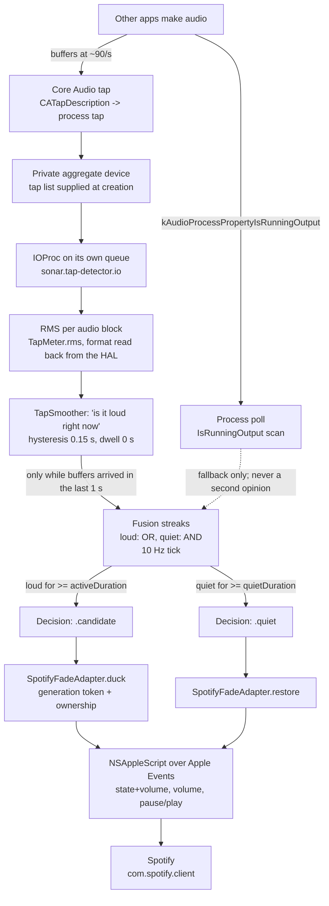

# How Auto-Pause works, and how it was made to work

Sonar's headline feature is **Auto-Pause**: when another app makes sound, Sonar pauses
Spotify, and when that sound stops, Sonar plays again.

This document is not a user guide. It is the engineering account of that feature — what
it does, and above all **how it shipped broken and was fixed by measurement**, because
every claim in it was produced by running the thing rather than reading it. If you are a
new maintainer, the failure modes below are the ones you are most likely to re-introduce
by accident, and each of them looked fine in code review.

**Scope and provenance.** Everything here was verified against the tree at commit
`623dfc2` and against measurements taken on the development machine: macOS 27.0
(26A428), Xcode 27 SDK. `file:line` citations are against that tree. Where a comment in
the code disagrees with the code's behaviour, the behaviour wins and the comment is
called out. Numbers attributed to a commit come from that commit's message, which is
where they were recorded at the time; nothing was re-measured for this document.

Related documents, each useful but each written from a narrower vantage point:
[`AUTOPAUSE-ENGINE-AUDIT.md`](AUTOPAUSE-ENGINE-AUDIT.md) (a static review — its line
numbers are pinned to an older tree),
[`AGENT-TESTS-REPORT.md`](AGENT-TESTS-REPORT.md) (the test suite),
[`AUTOPAUSE-SMOKE-TEST.md`](AUTOPAUSE-SMOKE-TEST.md) (the end-to-end harness),
[`RELEASE-TRIAGE.md`](RELEASE-TRIAGE.md) (the last audit-vs-code pass).

## Contents

- [What the feature does](#what-the-feature-does)
- [1. The two detectors, and why poll-only cannot do this job](#1-the-two-detectors-and-why-poll-only-cannot-do-this-job)
- [2. Getting audio out of a Core Audio tap: the four stacked bugs](#2-getting-audio-out-of-a-core-audio-tap-the-four-stacked-bugs)
- [3. Trusting the tap honestly](#3-trusting-the-tap-honestly)
- [4. Latency, and where it actually went](#4-latency-and-where-it-actually-went)
- [5. Generation tokens, and the bug they caused](#5-generation-tokens-and-the-bug-they-caused)
- [6. Ownership: never leave the music in the wrong state](#6-ownership-never-leave-the-music-in-the-wrong-state)
- [7. The permission trap specific to local development](#7-the-permission-trap-specific-to-local-development)
- [8. How it was actually tested](#8-how-it-was-actually-tested)
- [9. Known limitations, stated plainly](#9-known-limitations-stated-plainly)

## What the feature does

Sonar ticks a decision loop ten times a second
(`Packages/AutoPauseEngine/Sources/AutoPauseEngine/AutoPauseController.swift:62`). Each
tick refreshes two detectors of "is some other app making sound", combines them through a
streak state machine, and if the answer is sustained, hands Spotify to an adapter that
fades the volume, pauses, and remembers that it did.



The two halves that make this non-trivial, and that most of this document is about:

1. **Only one of the two detectors actually measures sound.** The tap does. The poll
   cannot (§1). Everything about correctness hangs on the tap working, and the tap was
   broken in four stacked ways before it worked (§2).
2. **The adapter owns the user's music.** If it is wrong about ownership it either
   pauses something it never paused, or leaves the music paused with nothing left to
   resume it (§6).

## 1. The two detectors, and why poll-only cannot do this job

Both detectors answer the same question, and only one of them is answering the question
that matters.

The **tap** (`TapDetector`) creates a Core Audio process tap, wraps it in a private
aggregate device, and receives real audio buffers. It computes RMS over each buffer
(`TapDetector.swift:136`) and compares it to a threshold. RMS is the only signal in the
whole feature that distinguishes *silence* from *sound*.

The **poll** (`PollDetector`) asks a much weaker question: "does this process currently
hold the output audio device?" It walks `kAudioHardwarePropertyProcessObjectList` and
keeps the objects whose `kAudioProcessPropertyIsRunningOutput` is non-zero
(`AudioDetector.swift:70`). That is a question about an open file handle, not about
audio.

The decisive measurement, taken on this machine: **a browser playing a video reported
`kAudioProcessPropertyIsRunningOutput == 0` while the tap plainly heard it**
(`AutoPauseController.swift:192-200`). So poll misses the very case the feature exists
for. And 45 seconds of pure digital silence through the output device still produced
`candidate: poll` and paused Spotify — recorded in commit `5d7e621`, because the poll
asked whether the process had the device, and it did.

A browser that is *paused* keeps the output open. That is the mirror-image failure: poll
reports loud for as long as the app holds the device.

| | Poll | Tap |
|---|---|---|
| Question | Is a process holding the output? | Is there sound, and how loud? |
| Permission | none | Screen & System Audio Recording |
| Sees a paused video | yes (loud) | no (quiet) |
| Sees a browser *playing* video | no (measured) | yes |
| Sees 45 s of digital silence | yes (loud) | no |

### What that costs in poll-only mode

When the tap is unavailable the engine does not stop; it runs poll-only
(`AutoPauseController.swift:236`) and the consequences are not subtle:

- **A paused video can hold the music paused for many seconds**, for as long as it keeps
  the output open.
- **If that app keeps holding the output, the resume may never come at all.** `quietDuration`
  never elapses, `restore()` is never called, and nothing else in the engine touches
  playback. Spotify stays paused indefinitely.

### Why there is no "stuck duck" timeout, and why that is the right answer

A timeout looks like the fix and is not. The legitimate case is a **two-hour film**: poll
reports loud for two hours, and any timeout short enough to rescue a user from a stuck
duck would also bring the music back underneath the film. Guessing wrong pauses the
user's music mid-movie, which is a worse failure than the one being fixed, and it is a
failure the user cannot explain or undo.

The honest position, recorded in commit `15a0185`, is: **this cannot be fully fixed in
code.** The only real repairs are (a) get the tap working, and (b) make the user able to
undo it without knowing why. (b) is already true — pressing play relinquishes cleanly
through the adapter's reconcile path (§6), and turning Auto-Pause off triggers a restore
(`Sonar/Engine/SonarEngineHost.swift:118-120`) — but it is not discoverable from the
pane. Everything the engine can legitimately do is shrink the number of ways it gets
into that state, which is what §2 and §3 are about.

## 2. Getting audio out of a Core Audio tap: the four stacked bugs

This is the centrepiece. The tap was created, reported "active", and never delivered a
single buffer. Loudness detection therefore did nothing, and the engine silently fell
back to poll — which means the whole feature shipped, in its first form, doing nothing,
with a UI that said it was working.

Four independent defects were stacked on top of each other. Each had to be fixed before
the next one could even be *observed*, which is why this took measurement rather than
reasoning: fixing one did not produce audio, it produced a different failure.

### Bug 1 — the aggregate device was built wrong

The first implementation created the aggregate device with only a name and a UID, then
attached the tap afterwards by writing `kAudioAggregateDevicePropertyTapList`. Measured
result: the aggregate reports `kAudioDevicePropertyStreams == 0` and exposes no input
stream, and `AudioDeviceStart` answers `'nope'` — `OSStatus` `0x6E6F7065`. The tap is
then created and "running" while delivering nothing.

Two things must be supplied **at creation**:

- `kAudioAggregateDeviceTapListKey` as an array of sub-tap dictionaries carrying
  `kAudioSubTapUIDKey` and `kAudioSubTapDriftCompensationKey`
  (`TapDetector.swift:936-938`).
- `kAudioAggregateDeviceIsPrivateKey` (`TapDetector.swift:935`).

Both matter. Private keeps the aggregate out of Audio MIDI Setup and lets coreaudiod reap
it at process exit; it is also why the startup sweep can ignore it (§2, bug 4). Drift
compensation is not optional decoration: an aggregate whose only sub-device is a tap has
no clock of its own, so without it the stream never runs (commit `07bfacb`).

Verified live after the fix: the same build then delivers **~90 buffers/s**
(commit `495403e`). The aggregate's UID is a fresh `UUID()` each time
(`TapDetector.swift:934`) — a fixed UID leaves a stale aggregate registered system-wide
after a crash, and every later create then fails with the same `'nope'`.

**The tripwire for this bug is now permanent.** `readInputFormat`
(`TapDetector.swift:833-852`) reads `kAudioDevicePropertyStreams` and the input stream
format *before* the IOProc is started, and throws a distinct `noInputStream` error rather
than waiting two seconds for buffers that will never arrive. The reason is that this
failure looks exactly like a permissions problem otherwise, and sends the user to System
Settings for a permission they already granted.

### Bug 2 — the IOProc was registered on the queue that builds the tap

This is the subtlest of the four and the one worth remembering.

`AudioDeviceCreateIOProcIDWithBlock` **dispatches** the callback to the queue you give it
(`TapDetector.swift:964`). The build ends in `confirmAudioIsFlowing`, which waits — in a
`while Date() < deadline` loop with `Thread.sleep` — for buffers to arrive
(`TapDetector.swift:1014-1022`). If that queue is the same queue the build is running on,
the build is *waiting for the very callbacks it is preventing from being delivered*. It
is a self-deadlock with a timeout bolted on: the confirmation could only ever time out,
and then report "tap started but delivered no buffers" about a tap that was working
perfectly.

The fix is one line of substance: the IOProc gets its own queue,
`sonar.tap-detector.io` (`TapDetector.swift:373`). The detector's work stays on
`sonar.tap-detector` (`:209`).

This is the bug that makes "measure it" the only reliable debugging method for this
whole subsystem. Both the broken and the working configurations produce a plausible log
line. Only a buffer counter separates them, which is why `ioProcCallbacks` exists
(`TapDetector.swift:300-303`).

### Bug 3 — teardown ran inline, and a wedged `AudioDeviceStop` froze everything

A tap that never produced buffers leaves `AudioDeviceStop` wedged inside coreaudiod.
Observed live on macOS 27 (commit `495403e`). When teardown ran inline on the tap queue,
that wedged call froze the detector **permanently**: no rebuild, no recovery, ever, for
the rest of the session.

The fix has four parts, all visible together in `tearDownTap` (`TapDetector.swift:1117-1157`):

- The object ids are taken and all detector state cleared **first**, so a wedged HAL call
  can never be observed or repeated (`:1121-1135`).
- The HAL calls themselves move to a dedicated serial queue,
  `sonar.tap-detector.teardown` (`:361`, `:1146`), which nobody waits on.
- Rebuilds are deferred until the teardown lands (`rebuildPending`, `:1152-1155`).
- `deinit` never waits on it either (`TapDetector.swift:415-429`); it hops to the same
  queue and lets coreaudiod clean up at exit.

Deferring rebuilds introduced a *new* failure, which is worth knowing about because it is
the same class of bug: if the machine suspends while `AudioDeviceStop` is wedged, the
completion that clears `tearingDown` never runs, and the only thing that consumed
`rebuildPending` was that same completion — so the tap stayed dead for the session with
no log line at all (audit finding S1-7). The fix is a watchdog
(`TapDetector.swift:569-596`, `teardownWatchdog = 5.0` at `:637`): if a teardown has been
in flight longer than five seconds, log it and build anyway. A leaked private aggregate
is a much smaller problem than a permanently dead detector.

### Bug 4 — the startup sweep destroyed its own device

`purgeStaleAggregates()` exists because earlier builds created a **published** aggregate,
and published aggregates survive a crash or a force quit and pile up in Audio MIDI Setup
(`TapDetector.swift:222-234`). It matches by name — `"Sonar auto-pause"`.

But the detector builds its aggregate on its own queue, so a sweep running concurrently
on another thread matched and destroyed the device that had *just* been created, tearing
it out from under a running IOProc. The tap then looked starved with a start that could no
longer be stopped.

The fix is to skip private aggregates (`TapDetector.swift:264`), which by construction
cannot be leftovers: the current aggregate is private, so it belongs to this process
alone. There is no property selector for the private flag, so the check reads the
composition dictionary (`TapDetector.swift:272-293`).

Note the sweep runs from `AutoPauseController.start()`
(`AutoPauseController.swift:139`) — i.e. on the main thread at launch.

### Also fixed in the same pass, because they are the same disease

These are all "reported healthy, actually useless", and they are worth reading together:

- **A tap with no output device comes up healthy.** Left unset, `deviceUID` and `stream`
  mean the tap starts and delivers buffers — all of them zero, because there is no output
  to capture. `isCapturing` is true, so the engine trusts it, so the tap wins every vote
  and reports the room permanently quiet: Auto-Pause does nothing, with no error anywhere
  and a green "Tap capturing (RMS 0.000)" in the pane. It is now a hard build failure
  with a reason (`TapDetector.swift:890-894`, `TapError.noOutputDevice`).
- **The output device is part of the tap's identity.** `outputDeviceUID` is a field of
  `TapTargets` (`TapDetector.swift:684`), so plugging in AirPods is now a *target change*
  and triggers a rebuild. Before, a device change resolved to the same process list, hit
  the "targets unchanged" early return, and left the tap measuring an output that no
  longer existed.
- **The format is read back from the HAL, not assumed** (`TapDetector.swift:833`). A tap
  hands over whatever the mix settled on; misreading it is silent — the buffers become
  noise, or nothing. `TapMeter.rms` now honours float32 and int16, interleaved or not
  (`TapDetector.swift:136-163`), and returns `nil` rather than `0` for a starved
  zero-byte buffer, which is how "running but starved" is told apart from "genuinely
  silent".
- **A failed build is retried with backoff** (`TapDetector.swift:643-667`), bounded at
  120 attempts (`:353`), with the delay saturating at 30 s — about an hour of trying.
  Without this, granting the permission in System Settings changed nothing until Sonar
  was relaunched. The bound exists because each attempt is expensive (a full process
  enumeration, an aggregate, up to 3 s waiting for it to come alive, up to 2 s waiting for
  buffers) and because the retries are the only thing that ever triggers the system
  prompt, so they cannot simply be given up on early.
- **Per-block RMS no longer notifies.** `publish` updates the status but does not call
  `onStatusChange` (`TapDetector.swift:1214-1224`); it used to re-announce "tap ready"
  through the engine ~90 times a second, flooding the bounded log and waking the UI.

## 3. Trusting the tap honestly

The governing principle, and the one to carry into any new code here: **"the tap exists"
and "the tap is active" are both lies.** Neither is evidence of anything. The only
evidence is **buffers arriving**, and even that has to decay.

### Trust is earned, revocable, and time-limited

`isCapturing` (`TapDetector.swift:476-484`) is computed, not stored: at least one buffer
has been delivered since the last build (`ioProcCallbacks > 0`), **and** the most recent
buffer is less than `captureFreshness = 1.0 s` old (`:489`). The timestamp is recorded for
*every* buffer, not just the first (`:1176-1177`), because a once-only timestamp makes the
freshness check report "stopped" within a second while audio is still streaming.

One second is chosen against the ~11 ms buffer period: comfortably longer than a dropped
buffer, short enough that a tap which goes quiet is reported within a second instead of at
the next app restart. A sticky "yes, it captured once" flag would keep the engine trusting
a dead tap — and a revoked permission looks exactly like that.

The engine's use of it is deliberately narrow (`AutoPauseController.swift:205`): the tap
gets the vote only while it is usable **and** capturing. It is never consulted as a second
opinion over poll; while it is live, poll does not vote at all
(`AutoPauseController.swift:234`), because poll cannot tell silence from sound and letting
it overrule the tap reintroduces the original bug exactly.

There is a third state, and it matters: **rebuilding.** `isCapturing` is false for the
whole second or two a build takes, and "not capturing" is also what a failed build looks
like. Conflating them is what let poll decide mid-rebuild — the engine switched sources
inside an episode, credited the streak to poll, and pausing the music when a rebuild
happened to be triggered (plugging in AirPods). `isRebuilding` (`TapDetector.swift:498`)
separates them, and the engine **holds** the decision during a rebuild
(`AutoPauseController.swift:218`, `:231-232`): no evidence either way, so no new episode
starts and no earned resume is missed.

> **Vestigial field, do not trust it.** `TapDetector._isCapturing`
> (`TapDetector.swift:213`) is written in `markCapturing` and `tearDownTap` but **never
> read** — the public `isCapturing` computes from the callback timestamps. Reading it
> would give you the sticky, wrong answer this whole section exists to avoid.

### Why `.active` is published late

`TapStatus.active` is set **only after** `confirmAudioIsFlowing()` returns true
(`TapDetector.swift:996-1000`). A tap that is running but starved is reported as a build
failure, not as active — it tears down, hands detection to poll, and schedules a retry.
The status also does not notify on RMS (§2), so `.active` is a one-off transition, not a
90 Hz stream.

### Which notifications rebuild, and why a device change never consults the cache

`TapDetector.plan(reason:last:resolved:force:sinceLastBuild:debounce:)` decides, and it is
a pure function so the rule is testable (`TapRebuildPlanTests.swift`). The rule:

- **A device change always rebuilds.** It does not compare `resolved` against `last`. That
  cache was resolved against the device that has just gone away, so it is not evidence
  about the new one — and getting this wrong is the worst outcome available, because it
  is a healthy tap: coreaudiod keeps delivering buffers, so `isCapturing` is true, the
  status is `.active`, the heartbeat is clean, and every sample is `0.0000`. The tap then
  wins every vote in the engine and Auto-Pause silently never pauses. Field report: 39
  `rebuild skipped (device change): targets unchanged` lines in the same window as a
  permanent `rms=0.0000`. `outputDeviceUID` being part of `TapTargets` (§2) covers the
  common case; it cannot cover a device-list change that leaves the resolved targets
  byte-identical, which is the case above.
- **Our own aggregate is not a device change.** Building one adds a device and releasing
  one removes it, and both post `kAudioHardwarePropertyDevices`, so treating every
  notification as a real change rebuilds forever. `deviceListChanged()` diffs the device
  list against the last one seen and ignores a diff that consists only of ids this
  detector created or is releasing. Identity, not a timer.
- **Everything else keeps the comparison.** Process-list churn republishes constantly, and
  rebuilding a working tap on each notification would drop detection for a second or two
  every time. Same ids really do mean the same thing there.
- **A coalesced rebuild is forced** and keeps the reason it was coalesced under, so the
  log still says what the build was for. Waiting for another notification to arrive is
  how a device change gets dropped entirely.

### The tap is re-verified after every rebuild, not once at launch

`beginVerification(of:)` is called at the end of every successful `buildTap`, and
`reportCaptureHealth` closes the window `verifyWindow` (5 s) later with one of three
verdicts:

- `tap verified: RMS 0.1832 peak 0.7410 after this build (output …)` — a real level, in
  the log, on every build. This is the line the README and the smoke script look for, and
  it now carries the proof instead of asserting a memory of launch.
- `tap measuring silence: rms 0.0000 peak 0.0000 for 5s after this build (output …)` —
  buffers arriving with zeros. **This is not automatically a fault**: Spotify is excluded
  from the tap on purpose (`PollDetector.excludedBundleIDs`, §2), because it is the thing
  being ducked, so a room where only Spotify is playing correctly measures 0.0000. It
  becomes a fault the moment something *else* makes sound. Logged once per silent stretch
  rather than once per rebuild, because the rebuilds are frequent and the log is capped.
- `tap verification failed: no buffers …` — a tap that died after passing its build check.

`confirmAudioIsFlowing` only proves buffers *arrive*; a tap bound to a replaced output
arrives with zeros, so it cannot be the whole check. The engine side is symmetric:
`AutoPauseController.tapStatusChanged(.starting)` clears `tapHasAudibleSignal`, so every
rebuild re-earns the `.tapVerified` event instead of inheriting it.

The engine's *vote* is deliberately still `isCapturing` and not `lastPeak > 0`
(audit §3b suggests otherwise). Gating on a non-zero sample would hand every decision to
poll for as long as the room is quiet, and poll cannot tell silence from sound — it would
report a paused video as loud. A quiet room has to be a decision the tap is allowed to
make.

### A log sentence is not a target

`TapTargets.==` is hand-written to compare the four fields that decide what the tap
captures — the excluded ids, the included ids, exclusivity and the output UID — and
deliberately **not** `excludedSummary`, which is a log line.

It was part of the synthesized identity, and the field log shows what that cost: coreaudiod
keeps process object ids for processes that have already exited and hands out new ones as
they come and go, so the resolver logged

```
tap: targets: skip-stale(98), skip-stale(115), com.spotify.client(119), self(120), skip-stale(131)
tap: targets: skip-stale(98), skip-stale(115), com.spotify.client(119), self(120), skip-stale(138)
```

a few seconds apart, and every one of them tore the tap down and rebuilt it from scratch,
with the engine **holding** every decision for the second or two each rebuild took. The
object ids never changed; only the sentence describing them had. Skipping a rebuild on a
device change (§ above) and rebuilding on a `skip-stale` note are the same class of mistake
in opposite directions: letting a string stand in for a fact about the tap.

### The tap answers "is it loud right now"; fusion owns the dwell

This split was wrong at first and is now load-bearing.

The tap used to keep its own `TapConfig.activeDuration`, whose default is **1.0 s**
(`TapDetector.swift:31`, `:41`). Fusion then applied the user's setting — 0.1 s for the
Instant preset — *on top of that*. The two dwelled serially, so the Instant preset could not
react in under a second no matter what the UI said (commit `fa6e138`).

Now the app sets the tap's own dwell to **0** and gives it just enough hysteresis to ride
out a dropped buffer or a momentary dip (`Sonar/Engine/SonarEngineHost.swift:95`, `:99`):

```swift
tapConfig.activeDuration = 0   // fusion owns the dwell
tapConfig.gapTolerance = 0.15  // hysteresis only — not a second dwell
```

With `activeDuration == 0`, `TapSmoother.sample` returns true on the *first* above-threshold
sample (`TapDetector.swift:189`), and `gapTolerance` governs only decay — how long the
signal stays active after the last loud sample. That is why the value is 0.15 and not the
old 0.75: the gap tolerance used to double the resume latency on top of `quietDuration`.

One consequence worth naming, because it is a product behaviour rather than a bug: a short
sound now triggers a duck. A 0.3 s notification chime activates the tap immediately, holds
for 0.15 s, then decays, and fusion waits 0.3 s before restoring — so the music stops for
about half a second. `systemsoundserverd` and `usernoted` are excluded by name
(`PollDetector.swift:45-48`, and the equivalent exclusion in the tap's target resolution),
but third-party alert sounds are not, and are not meant to be.

## 4. Latency, and where it actually went

### Measured end to end

Measured with the end-to-end harness on macOS 27, timed **from the moment sound reaches the
speakers**:

| Preset | To pause | To resume | Where the time goes |
|---|---|---|---|
| Instant | **~0.33 s** | **~0.32 s** | tap buffer + fusion's 0.1 s trigger dwell + AppleEvents |
| Fade | **~3.3 s** | **~3.1 s** | 1 s trigger dwell + 2 s fade-out; 3 s quiet dwell + 2 s fade-in minus overlap |

The Fade figures are exactly the two things the mode is made of: a 1 s dwell before acting
(`AutoPausePreset.swift:46`) plus a 2 s fade (`:59-61`). Nothing is hiding in them.

The harness's own reported numbers for the same Instant run are 478 ms to pause and 468 ms
to resume (commit `4026573`). Those are larger, and deliberately: the harness times from
`afplay` being launched, which includes process spawn, and it reports an upper bound
together with its sampling quantum rather than implying precision it does not have
(`scripts/autopause-smoke.sh:1206-1217`). Its budgets are 2000 ms and 3000 ms
(`scripts/autopause-smoke.sh:72-73`).

### The costs that were actually found

**1. A protocol extension is statically dispatched, so half the code was dead.**

`stateAndVolume()` — one AppleScript round trip returning both player state and volume —
was declared in a protocol **extension**. Protocol-extension members are statically
dispatched through an existential, so every `control.stateAndVolume()` in the adapter ran
the two-read default, and `AppleScriptSpotifyControl`'s one-round-trip implementation was
unreachable. Every duck and every resume paid two AppleEvents where the code's own comment
claimed one (commit `8f45a63`). It is now a protocol **requirement**
(`SpotifyControl.swift:42`) with the two-read default kept in the extension for test fakes
(`:48`), and the override at `:126` is finally reachable.

**2. The ~300 ms in the old comments was never an AppleEvent.** It was the cost of spawning
`/usr/bin/osascript`. A real `NSAppleScript` round trip on this machine is **5-17 ms** for
the pause command, measured after the fix (commit `8f45a63`, now logged live by
`SpotifyFadeAdapter.swift:403-408`). Every latency budget built on the 300 ms figure is
therefore pessimistic by a wide margin.

> **The stale number is still in the code.** `SpotifyFadeAdapter.swift:355-359` and
> `:364-366` still say an AppleEvent round trip "costs ~300 ms here" and describe that as
> "the difference between instant and noticeably late". The *behaviour* is right; the
> number in the comment is wrong by more than an order of magnitude. Do not reason from it.

**3. A 10 Hz AppleEvent probe starved the decision loop.** Two distinct cases, both real:

- *Reconciliation.* The tick called `reconcileSync()` on every 0.1 s tick, and while owned
  that is 2-3 AppleEvent round trips, so the engine's serial queue was still draining
  queued work when the next fusion evaluation came due. Measured at the time: resume
  configured to 1.0 s, actual ~5.3 s, of which ~4.3 s was reconcile overhead (commit
  `fabc0c1`). Reconcile is now throttled to one round trip per `reconcileInterval` (0.5 s
  default) and never runs when playback is not owned (`AutoPauseController.swift:73`,
  `:297-305`).
- *The duck probe.* `duckImpl` re-probed Spotify on every tick, "because one AppleEvent
  round trip costs ~300 ms", so the ticks spent nearly all their time asking Spotify whether
  it was playing — and the stretched tick could not notice the sound stopping. There is now
  a short backoff (`SpotifyFadeAdapter.swift:353-362`, `skipProbeBackoff = 0.4 s`). A player
  that is not playing does not start playing on its own, so the backoff is safe.

Reconcile is also now called on **every owned tick**, not only on `.hold`
(`AutoPauseController.swift:238-256`). Restricting it to `.hold` meant a long loud episode
never re-checked its assumption, so an ownership that had gone stale survived
indefinitely: the engine believed it had paused Spotify, `duck()` short-circuited on
`isOwned`, and auto-pause silently did nothing until the app was restarted. Seen live after
toggling Auto-Pause off and on.

**4. A 2 s fade occupied the entire decision loop.** `fade()` is a loop of
`max(1, Int(duration / fadeStepInterval))` iterations, each an AppleScript volume write plus
a 0.1 s sleep (`SpotifyFadeAdapter.swift:549-562`, `fadeStepInterval = 0.1` at `:43`). With
the shipped 2 s fade that is **20 AppleScript writes**, and it ran on the engine's own
serial queue — so for two whole seconds no loud/quiet streak could be evaluated and the
resume could not even be *noticed*, let alone acted on.

Adapter work now runs on the adapter's own serial queue in production
(`AdapterDispatch.onAdapterQueue`, `AutoPauseController.swift:16-30`; set by
`Sonar/Engine/SonarEngineHost.swift:69`). Tests keep the synchronous path so they can tick
and assert ownership immediately.

That same move has a second, non-obvious benefit: **it keeps `NSAppleScript` on exactly one
thread.** Commit `b291620` records `NSC_BAD_ACCESS` / `objc_msgSend` / `objc_release` inside
`NSAppleScript` on a GCD worker thread; one is a known hazard, two concurrent threads inside
it is strictly worse. Every production entry point now hops to `sonar.spotify-fade`, so
there is exactly one thread that ever enters `NSAppleScript`. The `*Sync` methods are still
`public` (`SpotifyFadeAdapter.swift:164-166`), so nothing *prevents* the split from being
reintroduced — that is the one regression guard still missing.

**5. Two full audits of the same code disagreed about the tap.** The first audit concluded
the sandbox was blocking the tap, on the evidence that a build without
`com.apple.security.app-sandbox` failed identically. It was wrong: at the time no permission
had been granted either (commits `5d7e621`, `07bfacb`). Removing the sandbox would have been
the wrong fix, and would have cost the release its sandbox.

## 5. Generation tokens, and the bug they caused

The adapter has a generation counter (`SpotifyFadeAdapter.swift:58`) so that a new action can
abort a stale one in flight: `fade()` checks the token on every step and returns if it moved
(`:557`), and the pause after the fade is guarded the same way (`:389`).

The bug is a one-line mistake with a spectacular failure mode. The engine calls `duck()` on
**every 10 Hz tick** for as long as another app is loud. `duck()` bumped the generation token
unconditionally. So every new tick invalidated the fade already running: `fade()` checked the
token, saw it had moved, and bailed out **before reaching the pause**.

In Fade mode this meant the feature never paused Spotify at all. It pinned the volume to zero
and left the player running. Reconciliation then read "playing" as the user pressing play,
relinquished ownership, and the engine started again — several times a second.

The rule that works (`SpotifyFadeAdapter.swift:136`, and `:148` for the same idea in the
other direction):

```swift
// Supersede only when this is genuinely a new action.
if !duckInProgress { nextGeneration() }
```

Keying on "is a duck already in flight" rather than "are we owned" preserves the token's real
job: a duck that arrives while a **restore** is running *is* a new action and must supersede
it. Repeated ducks during a duck, and repeated restores during a restore, must not cancel each
other.

### The part worth remembering

**This bug was latent for a long time, and moving the fade off the engine queue exposed it.**

With the adapter on the engine queue, the tick was blocked for the whole fade, so no
*competing tick could arrive* to invalidate anything. The generation token was therefore
almost permanently true in production — which is exactly what the static audit found and
called "the generation-token machinery is dead in production" (audit finding S1-5). Moving
the fade to the adapter's queue removed the accidental mutual exclusion, the competing ticks
started arriving, and a rule that had been wrong all along became fatal.

It is a good illustration of the general trap in this codebase: **this feature has repeatedly
shipped defects that were unreachable only because of a different defect.** The tap's dwell
stacking on fusion's was invisible while poll drove everything. The dead `stateAndVolume()`
was invisible while round trips cost ~300 ms. Fixing a latency bug unmasks a correctness bug.

## 6. Ownership: never leave the music in the wrong state

The adapter's contract (`SpotifyFadeAdapter.swift:26-34`) is that it resumes Spotify **only**
if it was the thing that paused it, to the same pid, and that it never clobbers a volume the
user changed. Every rule below exists because the alternative is leaving somebody's music in
the wrong state.

| Rule | Where | Why |
|---|---|---|
| Resume only if we paused | `takeOwnership` only after a `.playing` probe, `:367-381` | Otherwise a later restore resumes something the user paused |
| Same pid | `:420-427`, `:504-510` | A restarted Spotify is its own instance's business |
| A manual action relinquishes | `reconcileImpl`, `:501-533` | The user wins, always |
| Generation tokens | §5 | Stale async work must not touch playback |
| Volume is never clobbered | `restoreVolumeIfUntouched`, `:535-541` | The user's 42 must not become our 70 |
| Quit while ducked hands the music back | `restoreAtShutdown`, `:188-228` | Quitting is indistinguishable from deciding to leave it paused |

Three bugs in this area each left the music paused forever, which is the worst outcome a
feature whose entire job is to start the music again can have.

### Bug A — one empty read was treated as "Spotify quit"

`NSRunningApplication.runningApplications(withBundleIdentifier:)` reads a LaunchServices
cache, and it comes back empty for a moment during app-state churn. A single empty read was
treated as proof the player had quit, so ownership was dropped **on a live player** and
nothing was left to resume it. Observed live as an unexplained `relinquished: playerGone`
followed by a silent Spotify (commit `8f45a63`).

The lookup now retries briefly — 3 attempts, 0.12 s apart (`liveSpotifyPID`,
`SpotifyFadeAdapter.swift:301-307`). One empty read is a cache artefact, not evidence.

### Bug B — Spotify's `player state` lags our own command

Spotify does not flip `player state` in the same instant a pause command returns. Reading it
straight afterwards returns the **previous** value, and "playing" read that way is
indistinguishable from the user pressing play. So the adapter relinquished a duck it was still
in the middle of, the engine re-ducked immediately, and in Fade mode that was a visible loop
of fade-out / give-up / fade-out (commit `9a01cc9`).

`settledPlayerState()` (`SpotifyFadeAdapter.swift:274-285`) re-reads once, after a short wait,
when — and only when — the reported state is `.playing` and we sent a pause within the last
`stateSettleWindow = 2.0 s`. Without this, a restore or reconcile arriving just after a duck
ended the duck for good and left the music paused with nobody left to resume it.

### Bug C — mute-only never pauses, so "playing" is its own state

`DuckMode.muteOnly` sets the volume to zero and never pauses anything. Reconciliation's rule
is "if Spotify reports playing and it is not our own in-flight change, the user acted". In
mute-only that rule is false for the entire episode: **"playing" is what we caused**. The
first reconcile therefore handed the volume back in the middle of its own duck — the loud
blare the mode exists to prevent.

The state check is now gated on the mode and on our own in-progress work
(`SpotifyFadeAdapter.swift:519-527`), while the volume check stays independent, because in
mute-only the volume is the only way to notice the user intervening at all.

### Two more, fixed

- **Instant mode recorded no volume**, so it could not tell "the user moved the slider" from
  "we own the volume", and overwrote their change on the way out. It now records the volume it
  saw at duck time (`SpotifyFadeAdapter.swift:402`) — it still never *writes* the volume, but
  it now knows what "ours" means.
- **Quitting Sonar while ducked left the music paused forever.** `restoreAtShutdown`
  (`:188-228`) hands the music back on the way out, inside a 1.25 s budget (`:233`), using the
  one `stateAndVolume` round trip and writing the volume only if this mode actually lowered it.
  A quit that hangs is worse than a resume that did not happen, so the wait gives up and the
  queue is abandoned.

`AutoPauseController` observes `NSApplication.willTerminateNotification` for this
(`:158-167`). Note what is still unfixable: **a force quit runs no code at all**, so a
force-quit mid-duck leaves the music paused and possibly the volume part-way down. That is the
one wrong-music-state outcome in this feature that cannot be repaired, and it is stated rather
than papered over (commit `15a0185`).

## 7. The permission trap specific to local development

`CGPreflightScreenCaptureAccess()` is documented for **screen** capture. On an ad-hoc-signed
build it answers "not granted" even while the system-audio tap is demonstrably delivering
audio — which is exactly what it did here. A UI that trusts it shows an orange warning and a
"Grant…" button next to a live RMS reading, and because **a refused process is never
re-prompted**, that state has no way out of the app.

Buffers arriving is the authority. `SonarPermissions.state(for: .screenRecording)` returns
`.granted` whenever `isMeasuringLoudness` is true (`Sonar/Engine/SonarPermissions.swift:114-121`),
and `isMeasuringLoudness` is driven by the engine, not by the preflight flag
(`SonarEngineHost.swift:186` → `noteTapIsCapturing`, `SonarPermissions.swift:125-132`). The
preflight result is still probed and still logged beside it, but it no longer decides what
the user is told.

There is a distinct non-TCC state for the same symptom, `.tapSilent` — the grant is in place
but the tap is carrying nothing — because that is a different problem with a different fix.

**The second trap is that local builds cannot keep a grant.**

The app is ad-hoc signed for local runs (`CODE_SIGN_IDENTITY="-"`,
`docs/PARALLEL-WORK-CONTRACT.md:31`), and TCC grants are bound to the code hash. **Every
rebuild invalidates the grant and the OS re-prompts.** This is not a bug and there is no code
that avoids it. The sane fix is to sign development builds with an Apple Developer
certificate, so the identity is stable across rebuilds. Until that is set up, expect to
re-answer the consent dialog after each build, and do not interpret a fresh refusal as a
regression.

## 8. How it was actually tested

The lesson of this feature is a single sentence: **every claim in this document came from
running it, not from reading it.** Before the end-to-end harness existed, every statement
about Auto-Pause rested on code review — and code review had already produced a wrong
conclusion about the sandbox (§4, item 5) and a latency budget built on a number that was
never an AppleEvent (§4, item 2).

### The throwaway probe

The tap bugs were isolated with a throwaway probe: the same bundle identifier as the app
(Sonar's TCC grant, so the tap could actually be built) and the same aggregate configuration,
printing `kAudioDevicePropertyStreams`, the input stream format, and the per-callback buffer
count. That last number is what separates "tap exists" from "tap is carrying audio", and
once it was printed, each bug appeared in isolation.

The method that worked was **varying exactly one thing at a time**:

| Varied | What it isolated |
|---|---|
| tap list at creation vs `kAudioAggregateDevicePropertyTapList` after creation | `streams == 0`, `'nope'` (bug 1) |
| private vs published aggregate | visibility, reaping, and the sweep self-sabotage (bugs 1 and 4) |
| IOProc on its own queue vs the detector's queue | the self-deadlock (bug 2) |
| `com.apple.security.app-sandbox` on vs off | proved the sandbox was **not** the blocker |
| permissions granted vs not | separated TCC from configuration |

"Varying one thing at a time" is what made this tractable. Four stacked bugs means the first
fix produces a different symptom, not success, and a reader who changes two things cannot
attribute the difference.

### The tap as a loudness oracle

The single most useful tool was the tap itself used the other way round: **as a loudness
oracle that knows what the room actually sounds like.** It means a test can be timed from
the moment sound really arrives rather than from a keypress, a shell command, or a
process spawn — which is the difference between measuring this feature and measuring
`afplay`. After the fix, the tap tracked a real Chrome video at rms 0.03-0.33 with peak
0.75 (commit `495403e`), which is also how the working configuration was confirmed to be
measuring the room rather than its own zeroes.

### The harness, and its numbers

`scripts/autopause-smoke.sh` forces the Instant preset, plays a 1 kHz tone as "the other
app", samples Spotify's player state throughout, and reports measured pause and resume
latency against configurable budgets, with an `EXIT`/`INT`/`TERM` trap that always restores
Spotify and the preferences.

Its own reported numbers for a passing Instant run (commit `4026573`):

```
pause   478 ms      resume 468 ms      budgets 2000 ms / 3000 ms
```

measured from `afplay` launch, sampled every 100 ms, reported as an upper bound with the
sampling quantum printed beside it.

### The measurement traps, which are the real content of this section

**1. A root-owned preferences plist.** The sandboxed container plist was
`-rw------- root:wheel`, so the harness's writes went nowhere and the app silently ran the
**wrong preset** — while the test believed otherwise and would have reported a green result
for a run that measured a different configuration
(`docs/AUTOPAUSE-SMOKE-TEST.md:159-166`). A test that cannot prove which configuration it
measured is not a measurement.

**2. The harness slowed down the thing it was timing.** Every sample is a fresh `osascript`
process. Polling every 50 ms was **measured dragging the engine's own 10 Hz decision loop
down to 0.8 Hz** — the test was adding more load than the feature. Polling was dropped to
100 ms, which costs 200 ms of resolution and leaves the loop alone
(`scripts/autopause-smoke.sh:76-81`). This is the single most transferable lesson here: *a
measurement harness that competes for the resource under measurement reports the harness*,
and the number it produces looks like a latency regression in the product.

**3. The test could not fail, and when it did run it blamed the wrong thing.** Three faults,
all in the test:

- `afplay` was launched through the script's `run` wrapper, so `$!` was the pid of a
  subshell that merely waited for it. The wrapper also ran it in the foreground, which
  blocked for the whole tone and left `$!` unbound — and that expansion error fired at
  exactly the point where the script starts printing PASS lines, so **the summary still read
  green**.
- With the pid wrong, the step that stops the tone once the pause assertion has used its
  budget killed the wrapper and left `afplay` playing for the rest of the run. The resume was
  then timed against a room that was still loud, which is where a bogus six-second resume
  came from.
- A phase that starts and never finishes now fails the run. Without that, any crash between
  the first PASS and the last one is reported as success.

### What the unit suite does and does not cover

`swift test` (272 tests at commit `15a0185`, ~3 s, no hardware, no permissions) pins the
decision loop, the streak boundaries, the metering maths including non-interleaved float32
buffers — which is what a tap actually delivers — the adapter's ownership rules, and the
detector-preference contract.

It has one honest hole, which is worth knowing before you trust a green run: the positive
half of the tap contract — *a capturing tap takes the vote and poll cannot overrule it* —
is not testable, because `AutoPauseController.tap` is the concrete `TapDetector?` and there
is no way to inject a capturing fake (audit §5 rank 1, `AGENT-TESTS-REPORT.md` §3.7). Two
tests are written and parked behind `#if TAP_FAKES` awaiting a `TapSignalSource` seam.

Two more caveats about the suite: `TapDetectorTests.swift:135-145` calls `TapDetector().start()`
unconditionally, so **every `swift test` run attempts a real tap build** — it may create and
destroy a private aggregate device and may raise the screen-recording prompt. It should be
env-gated like its two neighbours. And the shipped tests are the only thing standing between
a refactor and a repeat of the generation-token bug in §5.

## 9. Known limitations, stated plainly

Not fixed, not hidden, not rediscoverable as if new:

1. **Poll-only mode can hold the music paused indefinitely.** A process that keeps the audio
   output open while silent will do it, and no timeout fixes it without breaking long videos
   (§1). This is the top release risk and it is inherent to `IsRunningOutput`.
2. **A force quit mid-duck leaves the music paused, and possibly the volume part-way down.**
   No code runs on `SIGKILL`. Every exit path where code *does* run hands the music back.
3. **If the user pauses Spotify by hand while another app is loud, the engine resumes it.**
   `player state` reads `paused` whether we paused it or they did, and `restoreImpl` treats
   `.paused` as "ours to resume" (`SpotifyFadeAdapter.swift:454-456`). This contradicts the
   module's own contract and it is a genuine ambiguity, not a coding mistake: the suggested
   mitigation (compare track position at duck time) is not clean.
4. **A revoked Automation permission is a silent no-op.** `run()` now correctly returns nil,
   so the state is "cannot talk to Spotify" rather than a half-parsed error string
   (`SpotifyControl.swift:167-173`), but `SonarEngineHost.handle` sets a label for
   `.skippedNotPlaying` and writes no log line, so a completely broken feature leaves no
   evidence in the log.
5. **Grant revoked while the preferences pane is closed is not re-checked** until the pane is
   reopened. There is no TCC change notification. The engine degrades correctly (poll-only,
   loudly) — it is the *explanation* that is missing.
6. **Two Sonar instances will both duck and both restore**, and they will fight. Neither sees
   the other. Untested.
7. **Cross-queue state in the controller is unsynchronised** — `enabled`, the fusion durations
   and `adapter.mode` are written on the main thread and read on the engine and adapter
   queues (audit S1-10). Every field is a single word, so there is no torn value to act on;
   the worst observable is a wrong countdown in the pane. The proper fix is a settings-value
   refactor, deliberately not attempted this close to a release.
8. **The IOProc takes two locks per audio block** (`TapDetector.swift:1173`). It is not the
   main thread, but an IOProc that blocks can glitch the very output the tap aggregate is
   clocking. The real fix — an atomic counter plus a format snapshot taken at build time — is
   deliberately not attempted.
9. **`gapTolerance` does not follow the user's resume delay.** It is a hard-coded 0.15 s
   (`SonarEngineHost.swift:99`), so Instant's 0.3 s resume really costs about 0.45 s before
   any AppleEvent. Deleting it would make the configured value mean what it says; it changes
   the feel of the product, so it is a decision rather than a patch.
10. **A short sound now ducks.** With the tap's own dwell at 0, a 0.3 s notification chime
    pauses the music for roughly half a second (§3). A product decision inherited from the
    latency fix, not an oversight.
11. **Process objects appearing after a build are not excluded** for up to the 2 s rebuild
    debounce plus build time, because the tap's targets are resolved once per build.
12. **Comments in the engine that are now wrong.** Known, and a trap for the next reader:
    - `TapDetector.swift:6-19` — the file header still describes the *old* wiring ("the tap
      attached via `kAudioAggregateDevicePropertyTapList") and claims `AudioDeviceStart`
      returns `'nope'` and RMS is unverified. Every line of that header is obsolete; it
      describes the bug that was fixed.
    - `SpotifyFadeAdapter.swift:355-359`, `:364-366` — the "~300 ms per AppleEvent" figure
      (§4, item 2).
    - `purgeStaleAggregates` destroys every non-private match without logging what it
      destroyed (`TapDetector.swift:235-267`). Commit `495403e` says it "logs what it
      matched"; the current code does not. It does log the resolved *exclusions* per build
      (`TapDetector.swift:867`, `:688`), which is a different and more useful thing, but it
      is not the same as reporting a sweep.
    - `docs/PARALLEL-WORK-CONTRACT.md` (and commit `7214ffd`) records that the tap list was
      reverted to "a `CFArray` of `CFString` tap UIDs". The shipping code uses the
      dictionary form at creation (`TapDetector.swift:936-938`), which is the form verified
      to deliver ~90 buffers/s. The contract's line is obsolete.
    - `README.md` states gaps shorter than 750 ms inside a loud streak do not reset it. The
      app sets `gapTolerance` to 0.15 (`SonarEngineHost.swift:99`).
    - `scripts/autopause-smoke.sh:58-63`, `:69` — `PRESET_THRESHOLD` defaults to 0.02 and the
      comment explains it as "what the app persists". `AutoPausePreferencesModel.apply` now
      writes `preset.threshold` (`AutoPausePreferencesModel.swift:155`), so picking Instant
      persists **0.01**. The harness writes the threshold explicitly so its run is still
      self-consistent, but it is no longer exercising the value a user clicking "Instant"
      would get.
13. **Dead code worth knowing about, so nobody "fixes" it:** `TapDetector._isCapturing` is
    written but never read (§3); `RelinquishReason.notOwned` and `.wasPausedAlready` are never
    constructed; `AudioActivityTracker` and `ActivationTracker` have no production readers,
    and the tracker costs a live Core Audio property listener plus an `NSRunningApplication`
    resolution per process per scan.
